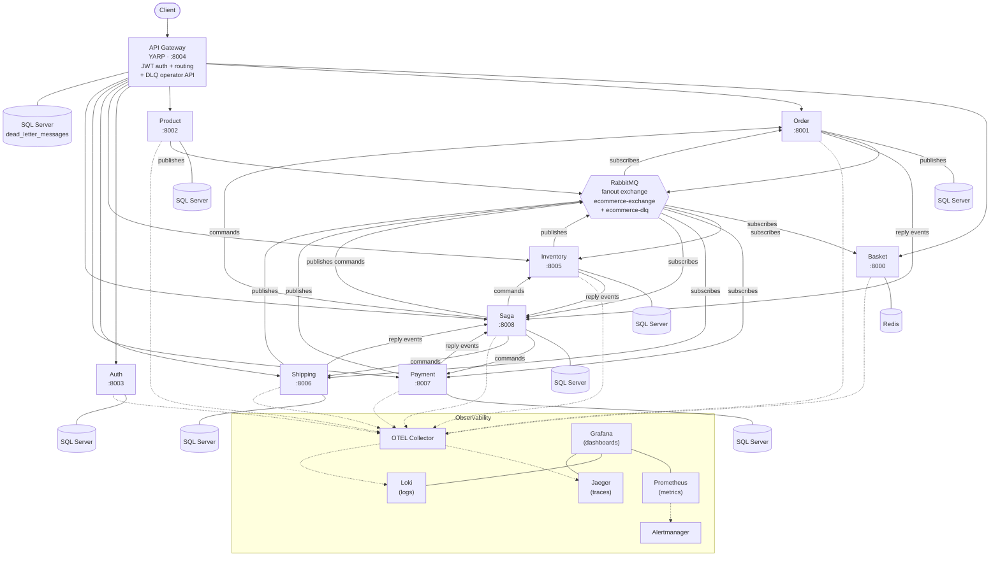
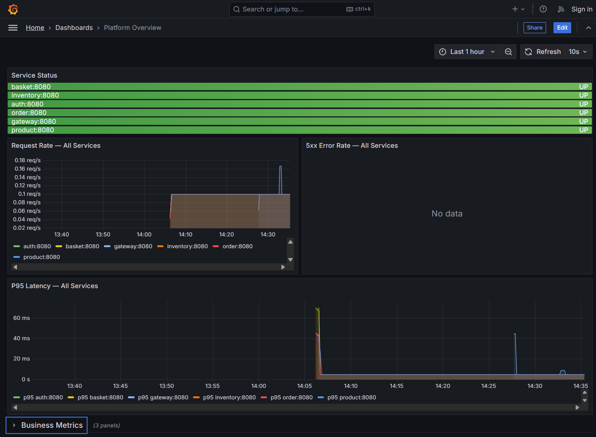
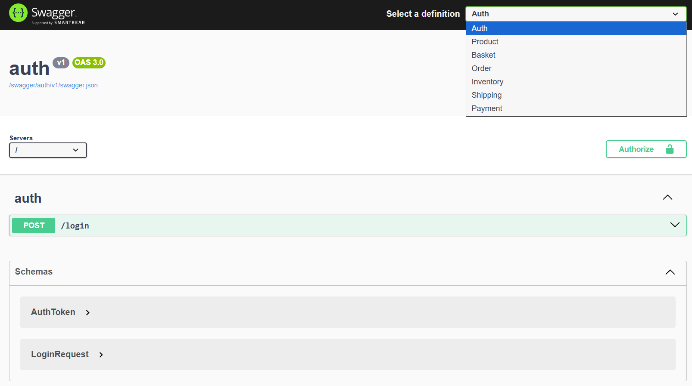

# E-Commerce Microservices Platform — Project Context

> **TL;DR — share-block.** I built this repo to learn and demonstrate microservices in .NET 10 end-to-end, designed around an **agentic coding workflow** with **Claude Code Max** and **GitHub Copilot Pro+** as the executing agents. It's an eight-business-service e-commerce platform with a YARP/Ocelot-switchable gateway, a transactional outbox, a Saga orchestrator for Order/Inventory/Payment/Shipping, RS256 JWT auth with `/jwks` discovery, an OpenTelemetry stack (Jaeger + Prometheus + Loki + Grafana), Kubernetes manifests, and a full GitHub Wiki sourced from `docs/wiki/`. This file is the single grounded entry point for AI agents, developer friends, and recruiters.

### What's interesting here

- **Dual-gateway switch.** The same gateway service compiles both **YARP** (default) and **Ocelot** behind a `Gateway:Provider` flag — same routes, same auth, same metrics, swap at boot.
- **Transactional outbox + provider-aware messaging + DLQ operator API.** Publishers never write straight to the broker; a poller drains the outbox, and RabbitMQ or Azure Service Bus dead letters surface through the same gateway-fronted operator endpoint.
- **Orchestrator-led saga across four participants** — Saga owns the workflow state and drives Order, Inventory, Payment, and Shipping through commands plus reply events.
- **`ECommerce.Shared` as a real NuGet package** against a local feed (`local-nuget-packages/`) instead of project references — closer to how real shared libraries propagate.
- **One `.slnx` per service, no root `.sln`.** Each service has an independent build/test boundary; `Directory.Build.props` enforces `TreatWarningsAsErrors`.
- **AI-first development workflow.** PRDs in `docs/prd/`, plans in `docs/plans/`, and `CLAUDE.md` / `.github/copilot-instructions.md` act as the contract between me and the agents.
- **Agentic coding workflow as a first-class artifact.** PRDs, plans, and ADRs are the contract; `CLAUDE.md` plus the AFK prompt at [`.github/prompts/afk-task.prompt.md`](.github/prompts/afk-task.prompt.md) are the runtime; Husky.Net pre-commit + `TreatWarningsAsErrors` are the typed feedback loops; a QMD-indexed session store is the memory.

### Links

- Code-first reference: [README.md](README.md)
- Wiki home: [docs/wiki/Home.md](docs/wiki/Home.md)
- Local messaging dev guide: [docs/local-dev/messaging.md](docs/local-dev/messaging.md)
- LinkedIn: [linkedin.com/in/daonhan](https://www.linkedin.com/in/daonhan)
- Substack: [substack.com/@daonhan](https://substack.com/@daonhan)

---

## Why I built it

I built this repo to teach myself microservices in .NET 10 the way I'd want to be taught — by shipping a system that actually walks the hard paths, not by reading another tutorial that stops at "hello world over HTTP." My day job rarely lets me touch the parts of distributed systems I find most interesting: saga orchestration, transactional outboxes, JWT issuance with JWKS, dead-letter handling, OpenTelemetry end-to-end. So I gave myself a portfolio-sized scope — eight business services, a real gateway, real observability, real deployment manifests — and committed to learning each piece by making it work, breaking it, and writing about it.

The second motivation is portfolio: I wanted one repository I can point a recruiter or a future teammate at and say "this is how I think about systems, this is how I work with AI tools, this is the depth I care about." Most of my professional code lives behind NDAs. This one is public on purpose.

The third motivation is the AI-pair-programming workflow itself. I wanted to find out — concretely, on a non-trivial codebase — where Claude Code Max and GitHub Copilot Pro+ each earn their keep, and where I'm still the one who has to make the call. The whole repo is the answer to that question.

## What it is

An eight-business-service e-commerce platform on .NET 10, built to run locally in Docker Compose and to deploy to Kubernetes.

- **Services.** Auth, Basket, Product, Order, Inventory, Payment, Shipping, Saga. One bounded context each, one datastore each, one `.slnx` solution each.
- **Datastores.** SQL Server for everything except Basket, which uses Redis. Each service owns its schema; there is no shared database.
- **Gateway.** A single API Gateway in front of the business services that compiles **both** YARP and Ocelot and selects between them at boot via the `Gateway:Provider` flag. Same routes, same auth rules, same metrics either way.
- **Auth.** RS256 JWTs issued by the Auth service and validated by every other service via the `/jwks` discovery endpoint — no shared secrets, no copy-pasted signing keys.
- **Async backbone.** RabbitMQ is the default local broker, and Azure Service Bus can be selected with `Messaging:Provider`. Use [docs/local-dev/messaging.md](docs/local-dev/messaging.md) to choose between Compose Rabbit, F5 + ASB emulator, F5 + shared dev namespace, and Compose `--profile asb`. Both broker paths use the gateway operator API for captured dead letters. Publishers go through a transactional outbox so a crash between "committed" and "published" cannot desynchronise the system.
- **Saga.** Saga service starts from `OrderCreatedEvent`, stores saga instance state, sends commands to Order/Inventory/Payment/Shipping, and advances from their reply events.
- **Observability.** OpenTelemetry traces, metrics, and logs flow through an OTEL Collector into Jaeger, Prometheus, and Loki, with Grafana on top and Alertmanager wired to a starter set of alerts.
- **Deployment.** Docker Compose for local, Kubernetes manifests under `kubernetes/` for `dev`/`staging`/`prod`, and an Azure-flavoured infra/pipelines folder under `Infrastructure - Deployment/`.
- **Shared library.** `ECommerce.Shared` is published as a NuGet package against a local feed (`local-nuget-packages/`) and consumed by every service via `<PackageReference>`, not via project references.

Service catalog:

| Service | Port | Datastore | Responsibility |
|---|---:|---|---|
| Basket | 8000 | Redis | Shopping cart CRUD and product price caching |
| Order | 8001 | SQL Server + Redis | Order creation, confirmation, cancellation, and order events |
| Product | 8002 | SQL Server | Product catalog and product price events |
| Auth | 8003 | SQL Server | User JWTs, service tokens, and JWKS discovery |
| API Gateway | 8004 | SQL Server | YARP/Ocelot routing, auth enforcement, combined Swagger UI, and DLQ operator API |
| Inventory | 8005 | SQL Server | Stock levels, reservations, backorders, and inventory reply events |
| Shipping | 8006 | SQL Server | Shipment lifecycle and shipment reply events |
| Payment | 8007 | SQL Server | Payment authorization, capture, void, refund, and payment reply events |
| Saga | 8008 | SQL Server | Owns order saga state; drives Order/Inventory/Payment/Shipping via commands |

If you want the runnable quickstart and the full per-service reference, that lives in the [README](README.md) and the [wiki](docs/wiki/Home.md). This page is the *why* and the *how I work*; those are the *what* and the *how to run*.

## Domain glossary

Short definitions of the load-bearing terms used throughout this repo. Each entry is platform vocabulary, not implementation guidance — see the ADRs and wiki for how each term is realised in code.

- **Saga.** A long-running business transaction that spans multiple services and reaches a consistent end state through a sequence of local steps and compensating actions. In this platform the Saga service drives Order → Inventory → Payment → Shipping and records each transition.
- **Outbox.** A reliability pattern where a service writes the events it intends to publish into the same database transaction as the state change that produced them. A separate poller drains the outbox to the message broker, so a crash between "committed" and "published" cannot leave the system inconsistent.
- **Dead-Letter Queue (DLQ).** A holding area for messages that could not be processed after the configured retries. Operators inspect, replay, or discard them through the gateway's operator API instead of losing the work or blocking the live queues.
- **Integration Event.** A message a service publishes to announce that something has happened in its bounded context, intended for other services to react to. Integration events are the only sanctioned way for services in this repo to communicate state changes — there is no shared database and no cross-service synchronous call for write paths.
- **Reservation.** A temporary hold the Inventory service places on stock when an order is created, so other concurrent orders cannot consume the same units. A reservation is later either committed (on `OrderConfirmed`) or released (on `OrderCancelled` or timeout).
- **Backorder.** A demand recorded against an item when on-hand stock is insufficient to satisfy it. Backorders let the saga progress under low-stock conditions and are reconciled when stock is replenished.
- **Authorize.** The first step of a payment, in which the issuer approves a hold against the customer's funds without yet moving money. The order can be confirmed once authorization succeeds, even though the merchant has not been paid.
- **Capture.** The follow-up step that converts an authorization into an actual transfer of funds to the merchant. Capture typically happens at fulfilment time, after stock is committed and shipment is created.
- **Refund.** The reversal of a previously captured payment, returning funds to the customer. Refunds may be full or partial and are surfaced as their own integration event so downstream services (orders, accounting, notifications) can react.
- **JWKS.** The JSON Web Key Set published by the Auth service at a well-known discovery endpoint. Other services validate incoming JWTs by fetching JWKS and matching the token's signing key, so secrets never have to be copied between services.
- **Fanout exchange.** A RabbitMQ exchange type that broadcasts every published message to every bound queue, with no routing-key filtering. The platform uses a single fanout exchange so adding a new subscriber is a configuration change, not a publisher change.
- **YARP.** Yet Another Reverse Proxy, Microsoft's modern reverse-proxy library for .NET. It is the default provider behind the API Gateway and handles routing, JWT enforcement, and combined Swagger UI.
- **Ocelot.** A long-standing .NET API gateway library. It compiles into the same gateway binary as YARP and can be selected at boot via the `Gateway:Provider` flag, giving a like-for-like fallback without a redeploy of the surrounding services.
- **Orchestration vs event-driven coordination.** Two styles of saga coordination. In _orchestration_ a central process tells each service what to do next; in the event-driven style each service reacts to peer events and decides its own next move. This platform now uses orchestration through the Saga service, which sends commands to Order, Inventory, Payment, and Shipping and advances on their reply events; ADR-0010 supersedes the earlier ADR-0008 decision.
- **Minimal API.** The ASP.NET Core programming model that defines HTTP endpoints as lambdas registered directly on the app, without MVC controllers. Every service in this repo exposes its HTTP surface this way, keeping endpoint files small and focused.
- **`.slnx`.** The XML-based Visual Studio solution format that replaces the legacy `.sln` for this repo. Each service ships its own `.slnx`, so build and test boundaries match service boundaries and there is no monolithic root solution.
- **OTEL Collector.** The OpenTelemetry Collector, a vendor-neutral agent that receives traces, metrics, and logs from the services and forwards them to Jaeger, Prometheus, and Loki. Services talk only to the Collector, which keeps the export pipeline swappable.

## Architecture at a glance

Eight business services sit behind a single API Gateway and coordinate asynchronously over RabbitMQ or Azure Service Bus. The gateway terminates JWT auth (validated against the Auth service's JWKS), aggregates Swagger, and fronts the DLQ operator API. The **Saga** service owns the Order → Inventory → Payment → Shipping workflow, sends commands to those four participants, and consumes their reply events; **Basket**, **Product**, and **Auth** stay outside the order saga but publish/consume their own events. Each service owns its datastore (SQL Server, with Redis for Basket) and emits OpenTelemetry traces, metrics, and logs through the OTEL Collector into Jaeger, Prometheus, and Loki, with Grafana on top.

The live stack view below is the Grafana side of that observability pipeline once Docker Compose is up and the dashboards have loaded.

## Architectural decisions

The load-bearing decisions live as MADR-lite ADRs under [docs/adr/](docs/adr/README.md). Each status is recorded in the ADR index, and each ADR links to the source folder(s) that implement it.

1. [ADR-0001](docs/adr/0001-api-gateway-yarp-default-ocelot-fallback.md) — API Gateway provider switch: YARP default with Ocelot fallback
2. [ADR-0002](docs/adr/0002-transactional-outbox-per-publishing-service.md) — Transactional Outbox per publishing service
3. [ADR-0003](docs/adr/0003-rs256-jwt-with-jwks-discovery.md) — RS256 JWT issuance with `/jwks` discovery
4. [ADR-0004](docs/adr/0004-rabbitmq-fanout-with-dlq-and-operator-api.md) — RabbitMQ fanout exchange with dead-letter queue and operator API
5. [ADR-0005](docs/adr/0005-ecommerce-shared-as-nuget-via-local-feed.md) — `ECommerce.Shared` distributed as a NuGet package via a local feed
6. [ADR-0006](docs/adr/0006-one-slnx-solution-per-service.md) — One `.slnx` solution per service; no root `.sln`
7. [ADR-0007](docs/adr/0007-ef-core-database-per-service.md) — EF Core with one database per service
8. [ADR-0008](docs/adr/0008-saga-choreography-no-central-orchestrator.md) — Event-driven saga coordination for Order/Inventory/Payment/Shipping (superseded)
9. [ADR-0009](docs/adr/0009-otel-jaeger-prometheus-loki-grafana.md) — OpenTelemetry + Jaeger + Prometheus + Loki + Grafana observability stack
10. [ADR-0010](docs/adr/0010-saga-orchestrator-supersedes-choreography.md) — Saga orchestrator owns Order/Inventory/Payment/Shipping (supersedes ADR-0008)

## Agentic coding workflow

This repo is the system I built *around* the AI tools, not just a project I built *with* them. The system is what I want to show; the eight services are the proof that the system works. Six anchors, each one tied to a path in this repo:

1. **Written contracts, not vibes.** Every non-trivial change starts as a PRD in [docs/prd/](docs/prd/), decomposes into tracer-bullet phases in [docs/plans/](docs/plans/), and — when a load-bearing choice falls out of it — lands an ADR in [docs/adr/](docs/adr/) (10 to date). Agents read the contract before they touch code. When the diff is wrong, the PRD was usually wrong first; fixing the doc fixes the next ten generations.
2. **Repo-resident guardrails.** [`CLAUDE.md`](CLAUDE.md), [`.claude/CLAUDE.md`](.claude/CLAUDE.md), and [`.github/copilot-instructions.md`](.github/copilot-instructions.md) lay out the conventions both agents must respect — `Given_When_Then` test names, `ApiModels/` vs `Models/` split, `TreatWarningsAsErrors`, the sandbox commit-gate policy. When an agent goes wrong, the file that needs the fix is almost always one of these three.
3. **Autonomous AFK loop.** [`.github/prompts/afk-task.prompt.md`](.github/prompts/afk-task.prompt.md) is a self-contained loop the agent can run unattended: pick the next AFK-eligible GitHub issue, implement the smallest end-to-end vertical slice, run the feedback loops, commit, update the issue. `hitl` / `human-in-the-loop` / `blocked` labels gate the agent out of work I want to drive myself.
4. **Typed feedback loops the agent can run alone.** `Directory.Build.props` promotes warnings to errors and enforces `.editorconfig`; Husky.Net runs `dotnet format --verify-no-changes`, `dotnet build`, and the Basket test suite on every commit; the public write-up of why this matters lives at [docs/essential-ai-coding-feedback-loops.md](docs/essential-ai-coding-feedback-loops.md). The strictness isn't for its own sake — an agent without ground truth invents plausible code, and these gates are the ground truth.
5. **Commit-gate honesty.** Sandbox runs that can't pass the hooks hand off to the host instead of committing with a deferred-validation footer. The prohibitions — no `--no-verify`, no `-c core.hooksPath=`, no `Hooks-Deferred:` footers, no partial commits — are spelled out under "Hard prohibitions" in [`CLAUDE.md`](CLAUDE.md), so neither I nor the agent is tempted to bypass them under time pressure.
6. **Memory and retrieval.** A `load-session-context` skill backed by a local QMD index pulls relevant prior sessions and curated docs into context before continuing work — saga refactors, DLQ runbooks, gateway tradeoffs are recallable months later instead of re-derived.

The two-tool split inside that workflow: **Claude Code Max** is the long-running, repo-aware partner that reads `CLAUDE.md` plus the PRDs and plans before it touches code — multi-file work, AFK runs, integration tests against `WebApplicationFactory<Program>`, and the judgement conversations ("is this the right saga shape?", "is `StockItem` the right aggregate boundary?"). **GitHub Copilot Pro+** is the in-editor reflex — inline completions, single-method edits, test scaffolding, "finish this LINQ query" moments. The contract is the same for both; only the latency differs.

The other half of the workflow is the boundaries I kept under direct human control, written down so neither side has to negotiate them per-task:

- **Security review.** Anything touching JWT issuance, JWKS publication, role-based authorization at the gateway, or secret handling I read line-by-line before merging. Agents draft; I approve.
- **Deployment.** Docker Compose, Kubernetes manifests, Azure pipelines. I write or thoroughly review every manifest. Agents are good at scaffolding YAML and bad at noticing when a probe path or a resource limit is quietly wrong.
- **Schema migrations.** EF Core migrations are generated locally, reviewed, and committed by hand. I never let an agent regenerate or hand-edit a migration that has already been applied.
- **`git push`, releasing a new `ECommerce.Shared` version, closing issues without a commit reference.** Mechanical-but-irreversible steps stay on me.

The net effect is that this workflow moved me from "can I learn this in my spare time?" to "I can ship a non-trivial system in my spare time and write about every choice." The workflow is the product; the eight services are the receipts.

## What I learned

In rough order of how surprising each one was:

1. **Event-driven coordination vs orchestration is a real architectural choice, not a style preference.** I started with peer-to-peer event coordination for Order → Inventory → Payment → Shipping (ADR-0008), then replaced it with the Saga service after the operational cost became concrete (ADR-0010). The trade-off is observable rather than theoretical: tracing helps, but a persisted orchestrator state machine is the file that tells you the saga's shape.
2. **Outbox semantics are subtler than the pattern's name suggests.** "Write the event in the same transaction as the state change" is the easy half. The hard half is the poller: idempotent publish, ordered drain per aggregate, dead-letter on poisoned messages, and an operator API to replay or discard them (ADR-0004). The outbox isn't done until the DLQ has a UX.
3. **JWT issuance with JWKS discovery is more boring than I expected, and that's the point.** RS256 + `/jwks` (ADR-0003) means no service ever sees the signing key, no shared secret has to rotate across service config files, and adding another service is a three-line change. The first time I rotated a key in dev and nothing broke is the moment the design earned its keep.
4. **OpenTelemetry wiring is 80% plumbing, 20% taste.** Getting traces, metrics, and logs through a single Collector into Jaeger/Prometheus/Loki is mechanical (ADR-0009). The interesting work is *what* to instrument: outbox lag, DLQ depth, saga step latency, RabbitMQ queue backlog. The dashboards and alerts (`HighHttpErrorRate`, `RabbitMqQueueBacklog`, `LowStockAlert`) are where the platform becomes operable rather than just observable.
5. **A dual-gateway switch is a cheap insurance policy.** Compiling both YARP and Ocelot behind a `Gateway:Provider` flag (ADR-0001) cost a single afternoon and gave me a non-trivial migration story, an A/B comparison surface, and a rollback plan for free. The lesson generalises: when two stacks both look like "the right answer," make the choice runtime-switchable until production tells you which one wins.
6. **Distributing a shared library as NuGet — even against a local feed — is qualitatively different from a project reference.** ADR-0005 forced me to think in versions: a breaking change in `ECommerce.Shared` requires a `<Version>` bump, a `dotnet pack`, a push to the local feed, and an explicit consumer upgrade. That ceremony is annoying for a hobby repo and exactly right for a real platform — it surfaces coupling that project references hide.
7. **The agentic coding workflow is the most reusable thing I built.** More reusable than any single service. Its ceiling is the quality of the contracts (PRDs, plans, ADRs, `CLAUDE.md`) and the strictness of the feedback loops (`TreatWarningsAsErrors`, Husky.Net pre-commit, the commit-gate prohibitions). Raise either, and the next ten generations of agent output get better for free. That insight reshaped how I write down anything I expect to revisit.

The gateway's combined Swagger UI is the fastest way to show the "single front door, many services" shape of the platform without explaining the route table first.

## Link tree

Every doc, plan, ADR, runbook, and deployment manifest folder in the repo, indexed once so this page can stand alone.

### Repo entry points

- [README.md](README.md) — runnable quickstart and per-service reference
- [CLAUDE.md](CLAUDE.md) — repo conventions for AI agents
- [`.github/copilot-instructions.md`](.github/copilot-instructions.md) — Copilot-side conventions
- [`docker-compose.yaml`](docker-compose.yaml) — local stack
- [LICENSE](LICENSE) — MIT

### Wiki ([`docs/wiki/`](docs/wiki/))

- [Home](docs/wiki/Home.md)
- [Architecture](docs/wiki/Architecture.md)
- [Getting Started](docs/wiki/Getting-Started.md)
- [API Reference](docs/wiki/API-Reference.md)
- [Integration Events](docs/wiki/Integration-Events.md)
- [Shared Library](docs/wiki/Shared-Library.md)
- [Testing](docs/wiki/Testing.md)
- [Observability](docs/wiki/Observability.md)
- [Kubernetes Deployment](docs/wiki/Kubernetes-Deployment.md)
- [Local Kubernetes Guide](docs/wiki/Local-Kubernetes-Guide.md)
- [Azure Deployment](docs/wiki/Azure-Deployment.md)
- [Contributing](docs/wiki/Contributing.md)
- [Troubleshooting](docs/wiki/Troubleshooting.md)
- [Roadmap](docs/wiki/Roadmap.md)
- Service pages: [API Gateway](docs/wiki/Service-API-Gateway.md) · [Auth](docs/wiki/Service-Auth.md) · [Basket](docs/wiki/Service-Basket.md) · [Order](docs/wiki/Service-Order.md) · [Product](docs/wiki/Service-Product.md) · [Inventory](docs/wiki/Service-Inventory.md) · [Payment](docs/wiki/Service-Payment.md) · [Shipping](docs/wiki/Service-Shipping.md) · [Saga](docs/wiki/Service-Saga.md)
- Wiki chrome: [_Sidebar](docs/wiki/_Sidebar.md) · [_Footer](docs/wiki/_Footer.md)

### PRDs ([`docs/prd/`](docs/prd/))

- [PRD index](docs/prd/PRD.md)
- [Context (this file's PRD)](docs/prd/PRD-Context.md)
- [Repository Wiki](docs/prd/PRD-Wiki.md)
- [API Gateway — YARP](docs/prd/PRD-ApiGateway-Yarp.md)
- [API Gateway — OpenAPI Aggregation](docs/prd/PRD-ApiGateway-OpenApi-Aggregation.md)
- [Auth Critical Hardening](docs/prd/PRD-Auth-Critical-Hardening.md)
- [DLQ Replay UI](docs/prd/PRD-DLQ-Replay-UI.md)
- [Messaging Local Dev Docs](docs/prd/PRD-Messaging-LocalDev-Docs.md)
- [Inventory](docs/prd/PRD-Inventory.md)
- [Observability](docs/prd/PRD-Observability.md)
- [Order Architecture Refactor](docs/prd/PRD-order-architecture-refactor.md)
- [Payment](docs/prd/PRD-Payment.md)
- [Shipping](docs/prd/PRD-Shipping.md)
- [StockItem Aggregate](docs/prd/PRD-StockItem-Aggregate.md)
- [Unified VS Solution](docs/prd/unified-vs-solution.md)
- [Azure Infrastructure Deployment](docs/prd/azure-infrastructure-deployment.md)

### Plans ([`docs/plans/`](docs/plans/))

- [Context](docs/plans/context.md)
- [E-Commerce Microservices](docs/plans/e-commerce-microservices.md)
- [API Gateway — YARP](docs/plans/api-gateway-yarp.md)
- [OpenAPI Gateway Swagger Aggregation](docs/plans/openapi-gateway-swagger-aggregation.md)
- [Auth Critical Hardening](docs/plans/auth-critical-hardening.md) · [Phase 1 summary](docs/plans/auth-critical-hardening-phase1-summary.md)
- [DLQ Replay UI](docs/plans/dlq-replay-ui.md)
- [Messaging Local Dev Docs](docs/plans/messaging-localdev-docs.md)
- [Inventory](docs/plans/inventory.md)
- [Observability Polish](docs/plans/observability-polish.md)
- [Order Architecture Refactor](docs/plans/order-architecture-refactor-plan.md)
- [Payment Service](docs/plans/payment-service.md) · [Phase 3](docs/plans/payment-phase3.md) · [Phase 4 summary](docs/plans/payment-phase4-summary.md)
- [Shipping Service](docs/plans/shipping-service.md)
- [StockItem Aggregate](docs/plans/stockitem-aggregate.md)
- [Unified VS Solution](docs/plans/unified-vs-solution.md)
- [Azure Infrastructure Deployment](docs/plans/azure-infrastructure-deployment-plan.md)

### ADRs ([`docs/adr/`](docs/adr/README.md))

- [Index](docs/adr/README.md) · [Template](docs/adr/0000-template.md)
- [ADR-0001 — API Gateway YARP default with Ocelot fallback](docs/adr/0001-api-gateway-yarp-default-ocelot-fallback.md)
- [ADR-0002 — Transactional Outbox per publishing service](docs/adr/0002-transactional-outbox-per-publishing-service.md)
- [ADR-0003 — RS256 JWT with `/jwks` discovery](docs/adr/0003-rs256-jwt-with-jwks-discovery.md)
- [ADR-0004 — RabbitMQ fanout with DLQ and operator API](docs/adr/0004-rabbitmq-fanout-with-dlq-and-operator-api.md)
- [ADR-0005 — `ECommerce.Shared` as NuGet via local feed](docs/adr/0005-ecommerce-shared-as-nuget-via-local-feed.md)
- [ADR-0006 — One `.slnx` solution per service](docs/adr/0006-one-slnx-solution-per-service.md)
- [ADR-0007 — EF Core database per service](docs/adr/0007-ef-core-database-per-service.md)
- [ADR-0008 — Event-driven saga coordination (superseded)](docs/adr/0008-saga-choreography-no-central-orchestrator.md)
- [ADR-0009 — OTEL + Jaeger + Prometheus + Loki + Grafana](docs/adr/0009-otel-jaeger-prometheus-loki-grafana.md)
- [ADR-0010 — Saga orchestrator (supersedes ADR-0008)](docs/adr/0010-saga-orchestrator-supersedes-choreography.md)
- [ADR-0011 — .NET Aspire local-dev overlay (amends ADR-0006)](docs/adr/0011-aspire-local-dev-overlay.md)

### Runbooks ([`docs/runbooks/`](docs/runbooks/))

- [Aspire local-dev overlay](docs/runbooks/aspire-local-dev.md)
- [Payment smoke test](docs/runbooks/payment-smoke.md)
- [Provider-agnostic DLQ capture and replay](docs/runbooks/provider-agnostic-dlq.md)
- [Saga orchestrator strangler](docs/runbooks/saga-orchestrator-strangler.md)

### Deployment manifests

- [Kubernetes manifests](kubernetes/) — `aks-{dev,staging,prod}-*` per-service manifests plus shared `rabbitmq.yaml`, `redis.yaml`, `sql.yaml`, `otel-collector.yaml`, `prometheus.yaml`, `grafana.yaml`, `loki.yaml`, `jaeger.yaml`, `alertmanager.yaml`, `exporters.yaml`
- [Infrastructure & pipelines](Infrastructure%20-%20Deployment/) — Bicep, Azure DevOps pipelines, Dockerfiles
- [Observability stack](observability/) — local OTEL collector + Grafana provisioning

### Other docs

- [`docs/auth-security-guide.md`](docs/auth-security-guide.md)
- [`docs/essential-ai-coding-feedback-loops.md`](docs/essential-ai-coding-feedback-loops.md)
- [`docs/instructions.md`](docs/instructions.md)
- [`docs/LOCAL_K8S_GUIDE.md`](docs/LOCAL_K8S_GUIDE.md)

---

_Built by Paul Nhan Nguyen Dao — [LinkedIn](https://www.linkedin.com/in/daonhan) · [Substack](https://substack.com/@daonhan)._
