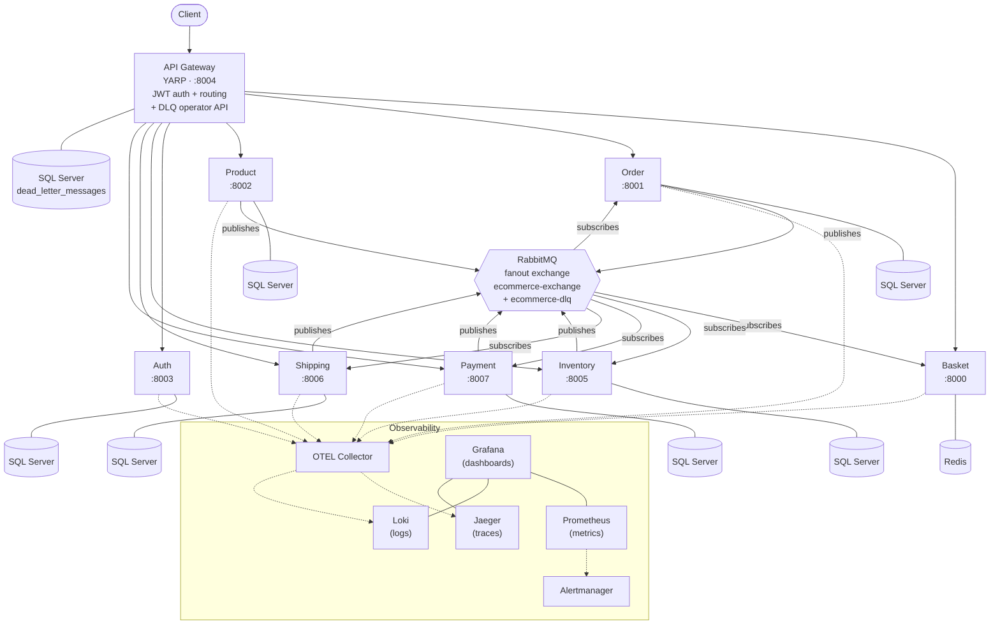

# E-Commerce Microservices Platform — Project Context

> **TL;DR — share-block.** I built this repo to learn and demonstrate microservices in .NET 10 end-to-end, paired with **Claude Code Pro** and **GitHub Copilot Pro+** as my coding partners. It's a seven-service e-commerce platform with a YARP/Ocelot-switchable gateway, a transactional outbox, an event-driven saga across Order/Inventory/Payment/Shipping, RS256 JWT auth with `/jwks` discovery, an OpenTelemetry stack (Jaeger + Prometheus + Loki + Grafana), Kubernetes manifests, and a full GitHub Wiki sourced from `docs/wiki/`. This file is the single grounded entry point for AI agents, developer friends, and recruiters.

### What's interesting here

- **Dual-gateway switch.** The same gateway service compiles both **YARP** (default) and **Ocelot** behind a `Gateway:Provider` flag — same routes, same auth, same metrics, swap at boot.
- **Transactional outbox + RabbitMQ fanout + DLQ operator API.** Publishers never write straight to the broker; a poller drains the outbox, and dead letters surface through a gateway-fronted operator endpoint.
- **Choreographed saga across four services** — Order → Inventory → Payment → Shipping, no central orchestrator, all coordination via integration events.
- **`ECommerce.Shared` as a real NuGet package** against a local feed (`local-nuget-packages/`) instead of project references — closer to how real shared libraries propagate.
- **One `.slnx` per service, no root `.sln`.** Each service has an independent build/test boundary; `Directory.Build.props` enforces `TreatWarningsAsErrors`.
- **AI-first development workflow.** PRDs in `docs/prd/`, plans in `docs/plans/`, and `CLAUDE.md` / `.github/copilot-instructions.md` act as the contract between me and the agents.

### Links

- Code-first reference: [README.md](README.md)
- Wiki home: [docs/wiki/Home.md](docs/wiki/Home.md)
- LinkedIn: [linkedin.com/in/daonhan](https://www.linkedin.com/in/daonhan)
- Substack: [substack.com/@daonhan](https://substack.com/@daonhan)

---

## Why I built it

_Coming in phase 4._

## What it is

_Coming in phase 4._

## Domain glossary

Short definitions of the load-bearing terms used throughout this repo. Each entry is platform vocabulary, not implementation guidance — see the ADRs and wiki for how each term is realised in code.

- **Saga.** A long-running business transaction that spans multiple services and reaches a consistent end state through a sequence of local steps and compensating actions. In this platform a saga walks Order → Inventory → Payment → Shipping and ends in either `OrderConfirmed` or `OrderCancelled`.
- **Outbox.** A reliability pattern where a service writes the events it intends to publish into the same database transaction as the state change that produced them. A separate poller drains the outbox to the message broker, so a crash between "committed" and "published" cannot leave the system inconsistent.
- **Dead-Letter Queue (DLQ).** A holding area for messages that could not be processed after the configured retries. Operators inspect, replay, or discard them through the gateway's operator API instead of losing the work or blocking the live queues.
- **Integration Event.** A message a service publishes to announce that something has happened in its bounded context, intended for other services to react to. Integration events are the only sanctioned way for services in this repo to communicate state changes — there is no shared database and no cross-service synchronous call for write paths.
- **Reservation.** A temporary hold the Inventory service places on stock when an order is created, so other concurrent orders cannot consume the same units. A reservation is later either committed (on `OrderConfirmed`) or released (on `OrderCancelled` or timeout).
- **Backorder.** A demand recorded against an item when on-hand stock is insufficient to satisfy it. Backorders let the saga progress under low-stock conditions and are reconciled when stock is replenished.
- **Authorize.** The first step of a payment, in which the issuer approves a hold against the customer's funds without yet moving money. The order can be confirmed once authorization succeeds, even though the merchant has not been paid.
- **Capture.** The follow-up step that converts an authorization into an actual transfer of funds to the merchant. Capture typically happens at fulfilment time, after stock is committed and shipment is created.
- **Refund.** The reversal of a previously captured payment, returning funds to the customer. Refunds may be full or partial and are surfaced as their own integration event so downstream services (orders, accounting, notifications) can react.
- **JWKS.** The JSON Web Key Set published by the Auth service at a well-known discovery endpoint. Other services validate incoming JWTs by fetching JWKS and matching the token's signing key, so secrets never have to be copied between services.
- **Fanout exchange.** A RabbitMQ exchange type that broadcasts every published message to every bound queue, with no routing-key filtering. The platform uses a single fanout exchange so adding a new subscriber is a configuration change, not a publisher change.
- **YARP.** Yet Another Reverse Proxy, Microsoft's modern reverse-proxy library for .NET. It is the default provider behind the API Gateway and handles routing, JWT enforcement, and combined Swagger UI.
- **Ocelot.** A long-standing .NET API gateway library. It compiles into the same gateway binary as YARP and can be selected at boot via the `Gateway:Provider` flag, giving a like-for-like fallback without a redeploy of the surrounding services.
- **Choreography vs Orchestration.** Two styles of saga coordination. In _orchestration_ a central process tells each service what to do next; in _choreography_ each service reacts to events and decides its own next move. This platform uses choreography — there is no orchestrator service.
- **Minimal API.** The ASP.NET Core programming model that defines HTTP endpoints as lambdas registered directly on the app, without MVC controllers. Every service in this repo exposes its HTTP surface this way, keeping endpoint files small and focused.
- **`.slnx`.** The XML-based Visual Studio solution format that replaces the legacy `.sln` for this repo. Each service ships its own `.slnx`, so build and test boundaries match service boundaries and there is no monolithic root solution.
- **OTEL Collector.** The OpenTelemetry Collector, a vendor-neutral agent that receives traces, metrics, and logs from the services and forwards them to Jaeger, Prometheus, and Loki. Services talk only to the Collector, which keeps the export pipeline swappable.

## Architecture at a glance

Seven business services sit behind a single API Gateway and coordinate asynchronously over RabbitMQ. The gateway terminates JWT auth (validated against the Auth service's JWKS), aggregates Swagger, and fronts the DLQ operator API. The four saga participants — **Order**, **Inventory**, **Payment**, **Shipping** — exchange integration events through a fanout exchange to walk the choreographed Order → Inventory → Payment → Shipping flow; **Basket**, **Product**, and **Auth** stay outside the saga but publish/consume their own events. Each service owns its datastore (SQL Server, with Redis for Basket) and emits OpenTelemetry traces, metrics, and logs through the OTEL Collector into Jaeger, Prometheus, and Loki, with Grafana on top.

## Architectural decisions

The load-bearing decisions live as MADR-lite ADRs under [docs/adr/](docs/adr/README.md). Each is `Accepted` and links to the source folder(s) that implement it.

1. [ADR-0001](docs/adr/0001-api-gateway-yarp-default-ocelot-fallback.md) — API Gateway provider switch: YARP default with Ocelot fallback
2. [ADR-0002](docs/adr/0002-transactional-outbox-per-publishing-service.md) — Transactional Outbox per publishing service
3. [ADR-0003](docs/adr/0003-rs256-jwt-with-jwks-discovery.md) — RS256 JWT issuance with `/jwks` discovery
4. [ADR-0004](docs/adr/0004-rabbitmq-fanout-with-dlq-and-operator-api.md) — RabbitMQ fanout exchange with dead-letter queue and operator API
5. [ADR-0005](docs/adr/0005-ecommerce-shared-as-nuget-via-local-feed.md) — `ECommerce.Shared` distributed as a NuGet package via a local feed
6. [ADR-0006](docs/adr/0006-one-slnx-solution-per-service.md) — One `.slnx` solution per service; no root `.sln`
7. [ADR-0007](docs/adr/0007-ef-core-database-per-service.md) — EF Core with one database per service
8. [ADR-0008](docs/adr/0008-saga-choreography-no-central-orchestrator.md) — Saga choreography (no central orchestrator) for Order/Inventory/Payment/Shipping
9. [ADR-0009](docs/adr/0009-otel-jaeger-prometheus-loki-grafana.md) — OpenTelemetry + Jaeger + Prometheus + Loki + Grafana observability stack

## AI workflow

_Coming in phase 4._ How Claude Code Pro and GitHub Copilot Pro+ were used, and which boundaries I kept under direct human control.

## What I learned

_Coming in phase 4._

## Link tree

_Coming in phase 5._ Will index every wiki page, PRD, plan, runbook, and Kubernetes manifest folder.

---

_Built by Paul Nhan Nguyen Dao — [LinkedIn](https://www.linkedin.com/in/daonhan) · [Substack](https://substack.com/@daonhan)._
