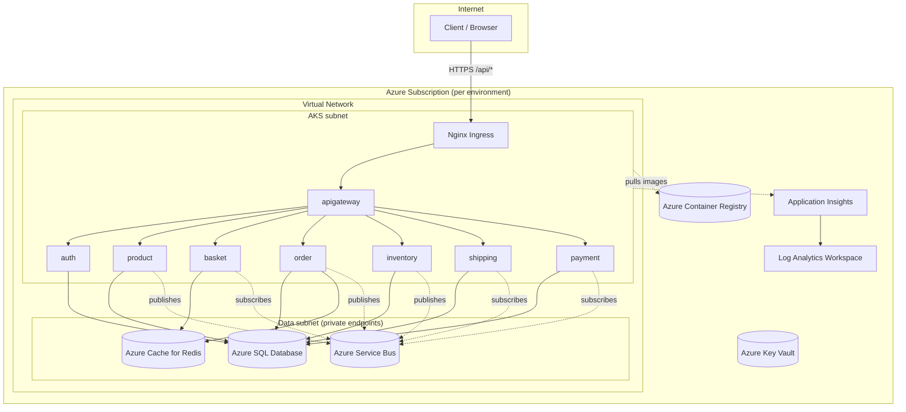
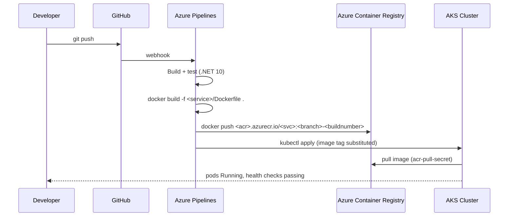

# Cloud Architecture

> Companion to [OVERVIEW.md](OVERVIEW.md). Describes the Azure topology
> that backs the AKS deployment of the e-commerce microservices platform.

## High-level architecture

## Network topology

A single Virtual Network per environment (Dev/Staging/Prod) with two
subnets:

- **AKS subnet** hosts the cluster's system and user node pools. All
  microservice pods run here. Outbound traffic to managed services flows
  through the VNet.
- **Data subnet** is reserved for private endpoints to Azure SQL Database,
  Azure Cache for Redis, and Azure Service Bus. Public endpoints are
  retained where convenient for early development; production hardens
  these to private endpoints only.

Inter-service traffic stays inside the cluster and resolves through
Kubernetes DNS (`<service>-clusterip-service.<namespace>.svc.cluster.local`).
The API Gateway uses YARP cluster destinations like
`http://auth-clusterip-service:8080` — same DNS pattern as the local K8s
manifests.

## Compute (AKS)

- **Cluster** — one AKS cluster per environment. Managed control plane,
  one or more node pools sized per environment (smaller in Dev, larger in
  Prod).
- **ACR attachment** — AKS uses managed-identity attach to ACR (no manual
  imagePullSecret needed for the kubelet itself, but pods still reference
  `acr-pull-secret` for explicit credentials in the manifest).
- **Pods** — every microservice runs as a `Deployment` with:
  - Liveness probe `/health/live`, readiness probe `/health/ready`
  - Resource requests/limits sized per environment
  - Environment variables for connection strings sourced from K8s secrets
  - Prometheus scrape annotations (`prometheus.io/scrape: "true"`)
- **Autoscaling** — each `Deployment` has an `HorizontalPodAutoscaler`
  targeting 70% CPU, with min/max replica counts that grow per
  environment (1/3 Dev, 1/5 Staging, 2/10 Prod).
- **Manifests** — environment-specific Kubernetes manifests live in the
  root [`kubernetes/`](../../kubernetes/) folder (`aks-dev-*`,
  `aks-staging-*`, `aks-prod-*`). Local and AKS workflows share this
  folder instead of maintaining a second manifest tree.
- **Ingress** — Nginx Ingress Controller in Production with path-based
  routing (`/api(/|$)(.*)` → `apigateway-clusterip-service:8080`).

## Data plane

| Concern        | Service                                | Per service?         |
|----------------|----------------------------------------|----------------------|
| Relational DB  | Azure SQL Database                     | One DB per service (Auth, Order, Product, Inventory, Shipping, Payment) on a shared logical SQL Server. |
| Cache / KV     | Azure Cache for Redis                  | Shared instance for Basket and Order. |
| Messaging      | Azure Service Bus topics               | Shared namespace, topics matching event types. RabbitMQ remains an option (Dev/local). |
| Secrets        | Azure Key Vault                        | One vault per environment. Pipeline variables remain the primary deploy-time source. |

## Observability

- **Application Insights** receives traces, metrics, and logs via the
  Azure Monitor OpenTelemetry exporter from `ECommerce.Shared`. Switch
  via `OpenTelemetry__Exporter=AzureMonitor` and
  `APPLICATIONINSIGHTS_CONNECTION_STRING`.
- **Log Analytics Workspace** backs Application Insights and AKS
  diagnostic logs.
- **Local stack (Jaeger / Prometheus / Loki / Grafana)** remains for
  local Docker Compose and local Kubernetes; cloud uses Azure-native
  tooling instead.

## Image flow

## Saga: order/inventory across the cluster

The Order ↔ Inventory saga (described in the root [`README.md`](../../README.md))
runs unchanged in AKS. Events flow through Service Bus or RabbitMQ
depending on `Messaging:Provider`; OpenTelemetry context propagates
through both. Trace continuity is visible end-to-end in Application
Insights.

## Configuration boundaries

| Setting                           | Source in cloud                                |
|-----------------------------------|------------------------------------------------|
| `ConnectionStrings__Default`      | K8s secret (from pipeline variable)            |
| `Redis__Configuration`            | K8s secret (from pipeline variable)            |
| `Jwt:Key`                         | K8s secret (from pipeline variable)            |
| `APPLICATIONINSIGHTS_CONNECTION_STRING` | K8s secret (from pipeline variable)      |
| `Messaging:Provider`              | Per-deployment env var (`AzureServiceBus` or `RabbitMq`) |
| `OpenTelemetry:Exporter`          | Per-deployment env var (`AzureMonitor` or `Otlp`) |
| YARP cluster destinations         | `appsettings.json` defaults; overridable via env vars (`Gateway__ClusterAddresses__Product`, `Gateway__ClusterAddresses__Order`, and so on) |
