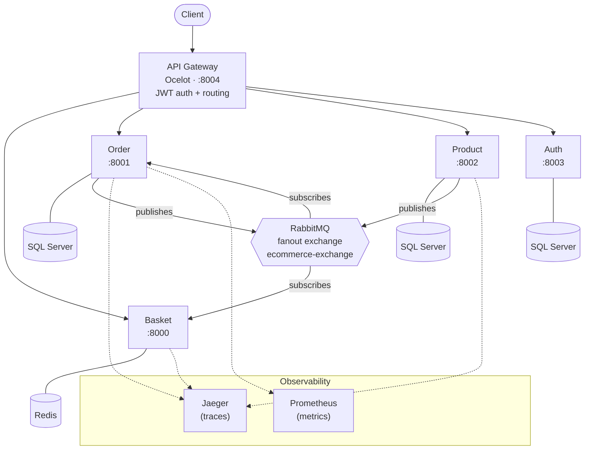

# E-Commerce Microservices Platform

A production-ready e-commerce system built with **.NET 8**, **ASP.NET Core Minimal APIs**, and **C# 12** — demonstrating microservice architecture patterns from domain decomposition through Kubernetes deployment.

## Architecture



## Services

| Service | Port | Datastore | Responsibility |
|---------|------|-----------|----------------|
| **Basket** | 8000 | Redis | Shopping cart CRUD, product price caching |
| **Order** | 8001 | SQL Server | Order creation, publishes `OrderCreatedEvent` |
| **Product** | 8002 | SQL Server | Product catalog, publishes `ProductPriceUpdatedEvent` |
| **Auth** | 8003 | SQL Server | User login, JWT token issuance (HMAC-SHA256) |
| **API Gateway** | 8004 | — | Ocelot routing, centralized auth, role-based access |

## Project Structure

```
├── api-gateway/              Ocelot API Gateway
├── auth-microservice/        JWT authentication service
├── basket-microservice/      Shopping basket + Redis cache
│   └── Basket.Tests/         Unit & integration tests
├── order-microservice/       Order management + event publishing
│   └── Order.Tests/          Unit & integration tests
├── product-microservice/     Product catalog + EF Core
│   └── Product.Tests/        Unit & integration tests
├── shared-libs/              ECommerce.Shared NuGet library
├── kubernetes/               K8s deployment manifests
├── observability/            Prometheus scrape config
├── docs/                     PRD and implementation plans
└── docker-compose.yaml       Full-stack local orchestration
```

Each microservice follows a consistent layout:

```
{Service}.Service/
├── Program.cs                Startup, DI, middleware
├── Dockerfile                Multi-stage build
├── Endpoints/                Minimal API route handlers
├── ApiModels/                Request/response DTOs
├── Models/                   Domain entities
├── Infrastructure/Data/      Storage abstractions + implementations
├── IntegrationEvents/        Published/subscribed events + handlers
└── Migrations/               EF Core migrations (if applicable)
```

## Getting Started

### Prerequisites

- [.NET 8 SDK](https://dotnet.microsoft.com/download/dotnet/8.0)
- [Docker Desktop](https://www.docker.com/products/docker-desktop/)
- [kubectl](https://kubernetes.io/docs/tasks/tools/) (for Kubernetes deployment)

### Run with Docker Compose

```bash
docker compose up --build
```

This starts all 10 containers: 5 microservices + SQL Server, RabbitMQ, Redis, Jaeger, and Prometheus.

### Run Individual Services

```bash
# Start infrastructure first
docker compose up sql rabbitmq redis -d

# Run a specific service
cd product-microservice/Product.Service
dotnet run
```

### Verify Services

| Endpoint | URL |
|----------|-----|
| API Gateway | http://localhost:8004 |
| RabbitMQ Management | http://localhost:15672 (guest/guest) |
| Jaeger UI | http://localhost:16686 |
| Prometheus | http://localhost:9090 |

## Shared Library

`shared-libs/ECommerce.Shared` is distributed as a local NuGet package and provides:

- **RabbitMQ** — `IEventBus` publisher, `RabbitMqHostedService` subscriber, keyed DI event handler registration
- **Transactional Outbox** — `OutboxBackgroundService` polls for unpublished events, preventing data/event inconsistency
- **JWT Authentication** — `AddJwtAuthentication()` shared across all secured services
- **OpenTelemetry** — Tracing (Jaeger export), metrics (Prometheus), RabbitMQ span propagation

### Build and Publish

```bash
cd shared-libs/ECommerce.Shared
dotnet pack -c Release
dotnet nuget push bin/Release/*.nupkg -s ../local-nuget-packages
```

## Key Patterns

| Pattern | Implementation |
|---------|---------------|
| **Per-service datastore** | Each service owns its data — no shared databases |
| **Event-driven communication** | RabbitMQ fanout exchange for async cross-service events |
| **Transactional Outbox** | DB write + outbox record in single transaction; background service publishes |
| **API Gateway** | Ocelot centralizes routing, JWT validation, and role-based access |
| **DTOs** | `ApiModels/` for API contracts, `Models/` for internal domain entities |
| **Resilience** | Polly retry pipelines for RabbitMQ, EF Core `EnableRetryOnFailure` for SQL |
| **Distributed tracing** | OpenTelemetry with context propagation across RabbitMQ messages |

## Testing

```bash
# Run all tests for a service
cd basket-microservice && dotnet test
cd order-microservice && dotnet test
cd product-microservice && dotnet test
```

- **Unit tests** — xUnit + NSubstitute, `Given_When_Then` naming convention
- **Integration tests** — `WebApplicationFactory<Program>`, real test databases with `IAsyncLifetime` cleanup
- **Event tests** — End-to-end RabbitMQ publish/subscribe verification

## Kubernetes Deployment

```bash
# Deploy infrastructure
kubectl apply -f kubernetes/sql.yaml
kubectl apply -f kubernetes/rabbitmq.yaml
kubectl apply -f kubernetes/redis.yaml

# Deploy observability
kubectl apply -f kubernetes/jaeger.yaml
kubectl apply -f kubernetes/prometheus.yaml

# Deploy microservices
kubectl apply -f kubernetes/product-microservice.yaml
kubectl apply -f kubernetes/order-microservice.yaml
kubectl apply -f kubernetes/basket-microservice.yaml
kubectl apply -f kubernetes/auth-microservice.yaml
kubectl apply -f kubernetes/api-gateway.yaml

# Verify
kubectl get pods
kubectl get services
```

Services discover each other via Kubernetes DNS (e.g., `rabbitmq-clusterip-service`, `mssql-clusterip-service`).

## Tech Stack

| Category | Technologies |
|----------|-------------|
| Framework | .NET 8, ASP.NET Core Minimal APIs, C# 12 |
| Messaging | RabbitMQ (fanout exchange, pub/sub) |
| Data | EF Core (SQL Server), Redis (distributed cache) |
| Testing | xUnit, NSubstitute, WebApplicationFactory |
| Observability | OpenTelemetry, Jaeger, Prometheus |
| Resilience | Polly, EF Core retries, Outbox pattern |
| Security | JWT (HMAC-SHA256), Ocelot API Gateway, role-based auth |
| Deployment | Docker, Docker Compose, Kubernetes |
