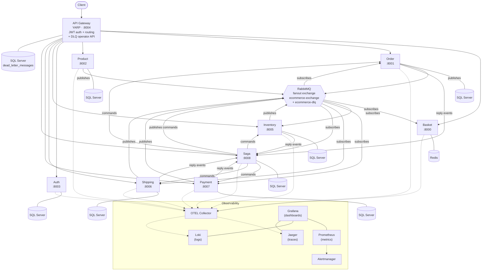

# E-Commerce Microservices Platform

> New here? Read [CONTEXT.md](CONTEXT.md) first — it's the human-narrated entry point with the project pitch, decisions index, and links out.

A production-ready e-commerce system built with **.NET 10**, **ASP.NET Core Minimal APIs**, and **C# 14** — demonstrating microservice architecture patterns from domain decomposition through Kubernetes deployment.

## Architecture


```mermaid
graph TD
    Client([Client]) --> GW["API Gateway<br/>YARP · :8004<br/>JWT auth + routing<br/>+ DLQ operator API"]

    GW --> Basket["Basket<br/>:8000"]
    GW --> Order["Order<br/>:8001"]
    GW --> Product["Product<br/>:8002"]
    GW --> Auth["Auth<br/>:8003"]
    GW --> Inventory["Inventory<br/>:8005"]
    GW --> Shipping["Shipping<br/>:8006"]
    GW --> Payment["Payment<br/>:8007"]
    GW --> Saga["Saga<br/>:8008"]

    Basket --- Redis[(Redis)]
    Order --- SQLOrder[(SQL Server)]
    Product --- SQLProduct[(SQL Server)]
    Auth --- SQLAuth[(SQL Server)]
    Inventory --- SQLInventory[(SQL Server)]
    Shipping --- SQLShipping[(SQL Server)]
    Payment --- SQLPayment[(SQL Server)]
    Saga --- SQLSaga[(SQL Server)]
    GW --- SQLGateway[(SQL Server<br/>dead_letter_messages)]

    Order -- publishes --> RabbitMQ{{"RabbitMQ<br/>fanout exchange<br/>ecommerce-exchange<br/>+ ecommerce-dlq"}}
    Product -- publishes --> RabbitMQ
    Inventory -- publishes --> RabbitMQ
    Payment -- publishes --> RabbitMQ
    Shipping -- publishes --> RabbitMQ
    Saga -- publishes commands --> RabbitMQ
    RabbitMQ -- subscribes --> Basket
    RabbitMQ -- subscribes --> Order
    RabbitMQ -- subscribes --> Inventory
    RabbitMQ -- subscribes --> Payment
    RabbitMQ -- subscribes --> Shipping
    RabbitMQ -- subscribes --> Saga

    Saga -- commands --> Order
    Saga -- commands --> Inventory
    Saga -- commands --> Payment
    Saga -- commands --> Shipping
    Order -- reply events --> Saga
    Inventory -- reply events --> Saga
    Payment -- reply events --> Saga
    Shipping -- reply events --> Saga

    subgraph Observability
        OTEL["OTEL Collector"]
        Jaeger["Jaeger<br/>(traces)"]
        Prometheus["Prometheus<br/>(metrics)"]
        Loki["Loki<br/>(logs)"]
        Grafana["Grafana<br/>(dashboards)"]
        Alertmanager["Alertmanager"]
    end

    Basket -.-> OTEL
    Order -.-> OTEL
    Product -.-> OTEL
    Auth -.-> OTEL
    Inventory -.-> OTEL
    Shipping -.-> OTEL
    Payment -.-> OTEL
    Saga -.-> OTEL
    OTEL -.-> Jaeger
    OTEL -.-> Loki
    Prometheus -.-> Alertmanager
    Grafana --- Prometheus
    Grafana --- Loki
    Grafana --- Jaeger
```

Saga owns the order workflow. Order publishes `OrderCreatedEvent`; Saga persists an instance, sends commands to Order, Inventory, Payment, and Shipping, and advances only when those services publish reply events carrying `SagaId` and `CausationId`.

## Services

| Service | Port | Datastore | Responsibility |
|---------|------|-----------|----------------|
| **Basket** | 8000 | Redis | Shopping cart CRUD, product price caching |
| **Order** | 8001 | SQL Server | Order creation, confirmation/cancellation, publishes `OrderCreatedEvent` / `OrderConfirmedEvent` / `OrderCancelledEvent` |
| **Product** | 8002 | SQL Server | Product catalog, publishes `ProductCreatedEvent` / `ProductPriceUpdatedEvent` |
| **Auth** | 8003 | SQL Server | User login (`/login`), service-to-service tokens (`/token`, `client_credentials`), RS256 JWT signing with `/jwks` discovery |
| **API Gateway** | 8004 | SQL Server | YARP reverse proxy (Ocelot fallback available), centralized auth, role-based access, combined Swagger UI, **DLQ operator API** (`/operator/api/failures*`) |
| **Inventory** | 8005 | SQL Server | Stock levels, reservations, backorders, low-stock monitoring; publishes `StockReserved`/`StockCommitted`/`StockReleased`/`StockAdjusted`/`StockDepleted`/`LowStock` events |
| **Shipping** | 8006 | SQL Server | Creates and tracks shipments on `StockCommitted`; publishes `ShipmentCreated`/`ShipmentDispatched`/`ShipmentDelivered`/`ShipmentCancelled`/`ShipmentReturned`/`ShipmentFailed`/`ShipmentStatusChanged` events |
| **Payment** | 8007 | SQL Server | Authorizes, captures, voids, and refunds payments driven by saga commands; publishes `PaymentAuthorized`/`PaymentCaptured`/`PaymentFailed`/`PaymentVoided`/`PaymentRefunded` events |
| Saga | 8008 | SQL Server | Owns order saga state; drives Order/Inventory/Payment/Shipping via commands |

## Project Structure

```
├── api-gateway/              API Gateway (YARP by default, Ocelot fallback)
├── auth-microservice/        JWT authentication service
│   └── Auth.Tests/           Endpoint tests
├── basket-microservice/      Shopping basket + Redis cache
│   └── Basket.Tests/         Unit & integration tests
├── order-microservice/       Order management + event publishing
│   └── Order.Tests/          Unit & integration tests
├── product-microservice/     Product catalog + EF Core
│   └── Product.Tests/        Unit & integration tests
├── inventory-microservice/   Stock, reservations, backorders
│   └── Inventory.Tests/      Unit & integration tests
├── shipping-microservice/    Shipment lifecycle, status tracking
│   └── Shipping.Tests/       Unit & integration tests
├── payment-microservice/     Payment authorization, capture, refunds
│   └── Payment.Tests/        Unit & integration tests
├── saga-microservice/        Order/refund saga orchestration + operator saga API
│   └── Saga.Tests/           Unit, integration, and end-to-end saga tests
├── shared-libs/              ECommerce.Shared capability packages
├── local-nuget-packages/     Local NuGet feed for shared-libs packages
├── kubernetes/               K8s deployment manifests (services + observability)
├── observability/            OTEL Collector, Prometheus, Alertmanager, Grafana, Loki config
├── docs/                     ADRs, PRDs, plans, wiki source, runbooks, patterns
├── plans/                    Active engineering plans
├── ralph/                    Agent/automation scripts
├── Directory.Build.props     Centralized MSBuild settings
└── docker-compose.yaml       Full-stack local orchestration
```

Each microservice follows **Clean Architecture + Vertical Slices** as the default service shape ([ADR-0012](docs/adr/0012-clean-arch-vsa-default-service-shape.md)); the Order service was the original pilot ([ADR-0011](docs/adr/0011-order-cleanarch-vsa-pilot.md)). The canonical implementation guide is [docs/PATTERNS.md](docs/PATTERNS.md).

```
{Service}.Service/
├── Program.cs                Startup, DI, middleware
├── Features/                 Vertical slices by HTTP route, event, or command
├── Domain/                   Aggregates, domain services, domain events
├── Contracts/Integration/    Cross-service message contracts
├── Infrastructure/           EF Core, Redis, adapters, outbox endpoints
└── Migrations/               EF Core migrations (if applicable)
```

## Getting Started

### Prerequisites

- [.NET 10 SDK](https://dotnet.microsoft.com/download/dotnet/10.0)
- [Docker Desktop](https://www.docker.com/products/docker-desktop/)
- [kubectl](https://kubernetes.io/docs/tasks/tools/) (for Kubernetes deployment)

### Run with Docker Compose

```bash
docker compose up --build
```

This starts the full stack: 8 business microservices (Basket, Order, Product, Auth, Inventory, Shipping, Payment, Saga) + API Gateway + infrastructure (SQL Server, RabbitMQ, Redis) + observability (OTEL Collector, Jaeger, Prometheus, Alertmanager, Grafana, Loki) + Prometheus exporters for RabbitMQ, Redis, and SQL Server.

RabbitMQ remains the default local broker for `docker compose up`, local smoke runs, and the Phase-4 saga regression path. To exercise the Azure Service Bus adapter locally, start the opt-in emulator profile:

```bash
export ASB_EMULATOR_SQL_PASSWORD="<strong local SQL password>"
docker compose --profile asb up -d servicebus-emulator servicebus-sql
```

See [docs/local-dev/messaging.md](docs/local-dev/messaging.md) for the four local messaging scenarios and the required provider environment variables. The emulator-specific SQL password guidance, health check, opt-in adapter test, DLQ verification, and teardown remain in [docs/qa/asb-emulator-local.md](docs/qa/asb-emulator-local.md).

### Run Individual Services

```bash
# Start infrastructure first
docker compose up sql rabbitmq redis -d

# Run a specific service
cd product-microservice/Product.Service
dotnet run
```

### Verify Services

| Endpoint | URL |
|----------|-----|
| API Gateway | http://localhost:8004 |
| Combined Swagger UI | http://localhost:8004/swagger (Development/Staging only) |
| RabbitMQ Management | http://localhost:15672 (guest/guest) |
| Jaeger UI | http://localhost:16686 |
| Prometheus | http://localhost:9090 |
| Alertmanager | http://localhost:9093 |
| Grafana | http://localhost:3000 (anonymous admin) |
| Loki | http://localhost:3100 |

### Try the API from Swagger UI

The combined Swagger UI at `http://localhost:8004/swagger` aggregates every gateway-routed endpoint behind a service dropdown (Auth, Product, Basket, Order, Inventory, Shipping, Payment). All paths and security annotations match what the gateway actually exposes, so "Try it out" exercises real routing and auth.

To call authenticated endpoints:

1. From the **Auth** dropdown, run `POST /login` with valid credentials. Copy the JWT from the response body.
2. Click **Authorize** at the top of the page, paste `Bearer <token>` (or just the token, depending on your Swagger UI version) into the value box, and confirm.
3. Switch to any other service in the dropdown — `AdminOnly` operations require an Administrator-claim token; `Default` operations accept any valid Bearer token.

The UI is gated to Development and Staging environments. Production gateway binaries return 404 on every `/swagger*` URL.

## Shared Library

`shared-libs/` ships nine direct capability packages plus the `ECommerce.Shared` umbrella compatibility metapackage, all on one lockstep version. Production services use the narrow direct packages they need rather than the umbrella; [ADR-0013](docs/adr/0013-shared-libs-multi-package-split.md) records the split and [docs/runbooks/shared-libs-versioning.md](docs/runbooks/shared-libs-versioning.md) is the bump/publish/sweep runbook.

| Package | Purpose |
|---|---|
| `ECommerce.Shared.Kernel` | `Event` base type, messaging options, telemetry constants, `MetricFactory` |
| `ECommerce.Shared.EventBus` | `IEventBus`, event handler registration, transactional outbox |
| `ECommerce.Shared.RabbitMq` | RabbitMQ broker adapter |
| `ECommerce.Shared.AzureServiceBus` | Azure Service Bus broker adapter |
| `ECommerce.Shared.Messaging` | `Messaging:Provider`, `AddPlatformEventBus`, publisher/subscriber composition |
| `ECommerce.Shared.DeadLetter` | DLQ capture, persistence, replay, discard, provider adapters |
| `ECommerce.Shared.Platform` | JWT auth, observability, health checks, OpenAPI helpers |
| `ECommerce.Shared.Contracts` | Shared saga command contracts |
| `ECommerce.Shared.Testing.Qa` | QA personas and seeding helpers |

Current published version: **3.1.0** (see `shared-libs/Directory.Build.props`).

### Build and Publish

```bash
dotnet pack -c Release shared-libs/ECommerce.Shared.slnx
cp shared-libs/**/bin/Release/*.nupkg local-nuget-packages/
```

## Key Patterns

| Pattern | Implementation |
|---------|---------------|
| **Per-service datastore** | Each service owns its data — no shared databases |
| **Event-driven communication** | Provider-aware async cross-service events over RabbitMQ or Azure Service Bus |
| **Transactional Outbox** | DB write + outbox record in single transaction; background service publishes |
| **Saga coordination** | Saga service owns the workflow state and drives Order, Inventory, Payment, and Shipping with commands |
| **Dead-Letter Queue + replay** | Failed broker messages and failed outbox rows are persisted in `dead_letter_messages`; the provider-agnostic gateway operator API allows replay/discard (single + batch) |
| **API Gateway** | YARP reverse proxy centralizes routing, JWT validation, and role-based access (Ocelot implementation retained as runtime-switchable fallback) |
| **Service auth** | Auth issues RS256 user tokens (`/login`) and service tokens (`/token`, `client_credentials`); consumers validate via `/jwks` and the shared `RequireService` policy |
| **DTOs** | `ApiModels/` for API contracts, `Models/` for internal domain entities |
| **Resilience** | Polly retry pipelines for RabbitMQ, EF Core `EnableRetryOnFailure` for SQL |
| **Distributed tracing** | OpenTelemetry with context propagation across RabbitMQ messages, including DLQ replay spans |

## API Gateway Provider (YARP / Ocelot)

The API Gateway ships with two reverse-proxy implementations compiled into the same project. The active one is selected at runtime via the `Gateway:Provider` config key. Defaults to **`Yarp`**.

| Config key | Env var | Values | Default |
|---|---|---|---|
| `Gateway:Provider` | `Gateway__Provider` | `Yarp`, `Ocelot` | `Yarp` |

The active provider is logged at startup (`ApiGateway starting with provider=Yarp`). Unknown values fail fast via options validation.

### Switching providers

```bash
# Docker Compose
Gateway__Provider=Ocelot docker compose up api-gateway

# Local dev
Gateway__Provider=Ocelot dotnet run --project api-gateway/ApiGateway
```

Or edit `api-gateway/ApiGateway/appsettings.json`:

```json
"Gateway": { "Provider": "Ocelot" }
```

### Rollback to Ocelot

If YARP misbehaves in production:

1. Set `Gateway__Provider=Ocelot` on the `api-gateway` deployment (e.g. `kubectl set env deploy/api-gateway Gateway__Provider=Ocelot`, or edit the env block in `kubernetes/api-gateway.yaml` / `docker-compose.yaml`).
2. Restart the gateway pod/container. No image rebuild required — both implementations are in the same binary.
3. Confirm the rollback by checking the startup log line for `provider=Ocelot`.

Upstream routes, port (`8004`), auth rules, health checks, and Prometheus metrics are identical across both providers, so clients and ops tooling are unaffected by the switch.

## Authentication

The platform uses **RS256-signed JWTs** issued by the Auth service. Two grant flows are supported:

| Flow | Endpoint | Use case |
|---|---|---|
| Password (user login) | `POST /login` | End-user authentication; returns a Bearer token consumed via the gateway |
| Client credentials (service-to-service) | `POST /token` | Internal calls between services (e.g. gateway DLQ poller → per-service `/internal/outbox/failed`) |

- **Key discovery** — Auth exposes the public signing key via `GET /jwks`. Resource services pull and cache JWKS through the shared `AddJwtAuthentication()` helper; no shared symmetric secret is distributed.
- **Service authorization** — The shared `RequireService` policy gates internal endpoints to callers presenting a service token (`scope=service`). User tokens cannot reach `/internal/*` routes.
- **Dev keys** — RSA dev keys ship under `auth-microservice/Auth.Service/dev-keys/` for local Docker Compose / `dotnet run`. Production deployments inject keys via secrets.

See [docs/wiki/API-Reference.md](docs/wiki/API-Reference.md) for the complete endpoint contract.

## Dead-Letter Queue (DLQ) and Operator API

Messages that exhaust their retry budget on a consumer queue are dead-lettered by the configured broker: RabbitMQ uses the platform DLQ queue, while Azure Service Bus uses each configured subscription's dead-letter subqueue. The API Gateway persists those broker failures — plus failed outbox rows pulled from each service's `/internal/outbox/failed` endpoint — into the same `dead_letter_messages` table. Operators interact with failures through gateway-hosted endpoints under `/operator/api/failures` (Bearer + `Operator` claim required):

| Method | Path | Purpose |
|---|---|---|
| `GET` | `/operator/api/failures` | Paged list with filters: `service`, `eventType`, `status`, `from`, `to`, `origin` (`Consumer\|Outbox`) |
| `GET` | `/operator/api/failures/{id}` | Failure detail (payload, stack trace, correlation id, optional Jaeger trace URL) |
| `POST` | `/operator/api/failures/{id}/replay` | Re-publish a single `Pending` failure to its `OriginalQueue` |
| `POST` | `/operator/api/failures/{id}/discard` | Mark a failure `Discarded` (body: `{ reason }`, required) |
| `POST` | `/operator/api/failures/replay-batch` | Replay many failures in one call (body: `{ ids: [...] }`) |

The operator routes and stored failure shape are unchanged across providers. For ASB, the gateway captures the subscriber DLQs named by service `EventBus:QueueName`: `basket-microservice`, `order-microservice`, `inventory-microservice`, `payment-microservice`, and `shipping-microservice`. If the local ASB emulator or one subscription is unavailable, the gateway logs the unavailable capture processor and keeps the operator endpoints alive.

Observability: `dlq_messages_total`, `dlq_replays_total`, and `dlq_discards_total` Prometheus counters (tagged with `provider`, `service`, `event_type`, and `outcome` where applicable); `dlq.replay` spans are emitted with the original event's `CorrelationId` for end-to-end trace linking.

Details: [docs/runbooks/provider-agnostic-dlq.md](docs/runbooks/provider-agnostic-dlq.md), [docs/plans/dlq-replay-ui.md](docs/plans/dlq-replay-ui.md), [docs/prd/PRD-DLQ-Replay-UI.md](docs/prd/PRD-DLQ-Replay-UI.md).

## Testing

```bash
# Run all tests for a service
cd api-gateway && dotnet test
cd auth-microservice && dotnet test
cd basket-microservice && dotnet test
cd order-microservice && dotnet test
cd product-microservice && dotnet test
cd inventory-microservice && dotnet test
cd shipping-microservice && dotnet test
cd payment-microservice && dotnet test
```

- **Unit tests** — xUnit + NSubstitute, `Given_When_Then` naming convention
- **Integration tests** — `WebApplicationFactory<Program>`, real test databases with `IAsyncLifetime` cleanup
- **Event tests** — End-to-end RabbitMQ publish/subscribe verification, including Testcontainers-based ack/retry/DLQ behavior tests

## Pre-commit hooks

[Husky.Net](https://alirezanet.github.io/Husky.Net/) is configured under `.husky/`. Hooks are restored automatically by `dotnet tool restore` and then activated with:

```bash
dotnet tool restore
dotnet husky install
```

On every commit the task runner enforces `dotnet format --verify-no-changes`, `dotnet build --no-restore`, and a fast Basket test slice. Run the equivalent checks locally before pushing:

```bash
dotnet format --verify-no-changes --verbosity minimal
# then `dotnet test` per service that you touched
```

## Deployment

The platform deploys to **Azure Kubernetes Service (AKS)** through per-service
Azure Pipelines. Bicep provisions the cloud infrastructure (VNet, AKS, ACR,
Azure SQL, Redis, Service Bus, Application Insights), each pipeline builds and
pushes a Docker image to ACR, and deploy stages roll the image into one of
three environments (`ecommerce-dev`, `ecommerce-staging`, `ecommerce-prod`).

| Doc | What it covers |
|---|---|
| [OVERVIEW](Infrastructure%20-%20Deployment/docs/OVERVIEW.md) | Environments, deployment model, where everything lives |
| [ARCHITECTURE](Infrastructure%20-%20Deployment/docs/ARCHITECTURE.md) | Cloud topology, network, AKS, data plane, observability |
| [SYSTEM_DESIGN](Infrastructure%20-%20Deployment/docs/SYSTEM_DESIGN.md) | End-to-end CI/CD: build, test, push, deploy |
| [TECH_STACK](Infrastructure%20-%20Deployment/docs/TECH_STACK.md) | Every Azure service and its role |
| [PATTERNS](docs/PATTERNS.md) | Codebase implementation patterns: service shape, slices, messaging, outbox, tests |
| [Devops Agent Setup](Infrastructure%20-%20Deployment/docs/Devops%20Agent%20Setup.md) | Migrating from Microsoft-hosted to self-hosted agents |
| [Local K8s Guide](docs/LOCAL_K8S_GUIDE.md) | Running the full stack on Docker Desktop / Minikube |

## Kubernetes Deployment

```bash
# Deploy infrastructure
kubectl apply -f kubernetes/sql.yaml
kubectl apply -f kubernetes/rabbitmq.yaml
kubectl apply -f kubernetes/redis.yaml

# Deploy observability
kubectl apply -f kubernetes/otel-collector.yaml
kubectl apply -f kubernetes/jaeger.yaml
kubectl apply -f kubernetes/prometheus.yaml
kubectl apply -f kubernetes/alertmanager.yaml
kubectl apply -f kubernetes/loki.yaml
kubectl apply -f kubernetes/grafana.yaml
kubectl apply -f kubernetes/exporters.yaml

# Deploy microservices
kubectl apply -f kubernetes/product-microservice.yaml
kubectl apply -f kubernetes/order-microservice.yaml
kubectl apply -f kubernetes/basket-microservice.yaml
kubectl apply -f kubernetes/auth-microservice.yaml
kubectl apply -f kubernetes/inventory-microservice.yaml
kubectl apply -f kubernetes/shipping-microservice.yaml
kubectl apply -f kubernetes/payment-microservice.yaml
kubectl apply -f kubernetes/api-gateway.yaml

# Verify
kubectl get pods
kubectl get services
```

Services discover each other via Kubernetes DNS (e.g., `rabbitmq-clusterip-service`, `mssql-clusterip-service`).

## Tech Stack

| Category | Technologies |
|----------|-------------|
| Framework | .NET 10, ASP.NET Core Minimal APIs, C# 14 |
| Messaging | RabbitMQ fanout exchange or Azure Service Bus topic/subscriptions via `Messaging:Provider` |
| Data | EF Core (SQL Server), Redis (distributed cache) |
| Testing | xUnit, NSubstitute, WebApplicationFactory |
| Observability | OpenTelemetry (traces + metrics + logs via OTLP), OTEL Collector, Jaeger, Prometheus, Alertmanager, Grafana, Loki |
| Health | `Microsoft.Extensions.Diagnostics.HealthChecks` via shared `AddPlatformHealthChecks` |
| Resilience | Polly, EF Core retries, Outbox pattern with failure tracking, provider-agnostic DLQ capture/replay, saga-orchestrated order/inventory/payment/shipping coordination |
| Security | RS256 JWTs (`/jwks` discovery), `client_credentials` service tokens, `RequireService` policy, YARP API Gateway (Ocelot fallback), role-based auth |
| Tooling | Husky.Net pre-commit hooks (`dotnet format` + build + Basket tests) |
| Deployment | Docker, Docker Compose, Kubernetes |
