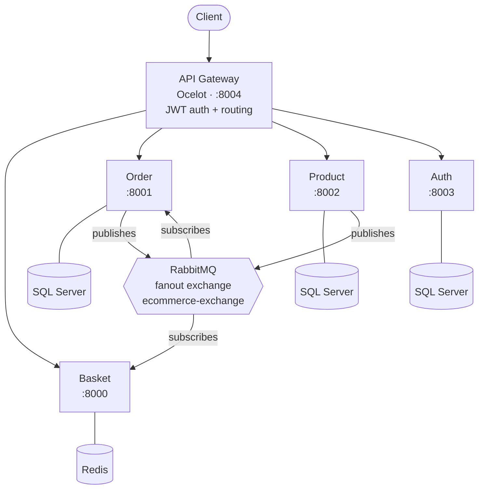

# E-Commerce Microservices Platform

## Project Overview

This is a **.NET 8 e-commerce microservices platform** built with **ASP.NET Core Minimal APIs** and **C# 12**. The system decomposes an e-commerce domain into five independently deployable services that communicate via REST (synchronous) and RabbitMQ events (asynchronous).

## Architecture



## Services

| Service | Port | Datastore | Responsibility |
|---------|------|-----------|----------------|
| **Basket** | 8000 | Redis | Shopping cart CRUD, product price caching |
| **Order** | 8001 | SQL Server | Order creation, publishes `OrderCreatedEvent` |
| **Product** | 8002 | SQL Server | Product catalog, publishes `ProductPriceUpdatedEvent` |
| **Auth** | 8003 | SQL Server | User login, JWT token issuance (HMAC-SHA256) |
| **API Gateway** | 8004 | — | Ocelot routing, centralized auth, role-based access |

## Shared Library

`shared-libs/ECommerce.Shared` is a local NuGet package consumed by all services. It contains:

- **RabbitMQ** — `IEventBus`, `RabbitMqEventBus` (publisher), `RabbitMqHostedService` (subscriber), keyed DI event handler registration
- **Outbox Pattern** — `OutboxBackgroundService` polls DB for unpublished events, ensuring data/event consistency
- **JWT Authentication** — `AddJwtAuthentication()` extension method shared across services
- **OpenTelemetry** — Tracing (Jaeger), metrics (Prometheus), RabbitMQ semantic conventions

## Project Structure

```
Nhamnhi/
├── api-gateway/          # Ocelot API Gateway
├── auth-microservice/    # JWT authentication service
├── basket-microservice/  # Shopping basket + Redis cache
├── order-microservice/   # Order management + event publishing
├── product-microservice/ # Product catalog + EF Core (SQL Server)
├── shared-libs/          # ECommerce.Shared NuGet library
├── kubernetes/           # K8s deployment manifests (10 YAMLs)
├── observability/        # Prometheus scrape config
├── docs/                 # PRD and implementation plans
├── local-nuget-packages/ # Local NuGet feed (gitignored)
└── docker-compose.yaml   # Full-stack local orchestration
```

Each microservice follows a consistent internal layout:

```
{Service}.Service/
├── Program.cs                    # Startup, DI, middleware
├── Dockerfile                    # Multi-stage build
├── Endpoints/                    # Minimal API route handlers
├── ApiModels/                    # Request/response DTOs
├── Models/                       # Domain entities
├── Infrastructure/Data/          # Storage abstractions + implementations
├── IntegrationEvents/            # Published/subscribed events + handlers
└── Migrations/                   # EF Core migrations (if applicable)
```

## Key Patterns & Conventions

- **Minimal APIs** — endpoints registered via `RegisterEndpoints()` extension methods on `IEndpointRouteBuilder`
- **Onion-style layers** — Domain models → Infrastructure (data access) → API endpoints
- **DTOs separate from domain** — `ApiModels/` for API contracts, `Models/` for internal domain
- **Per-service datastores** — each service owns its data; no shared databases
- **Event-driven sync** — RabbitMQ fanout exchange (`ecommerce-exchange`) for cross-service communication
- **Transactional Outbox** — DB write + outbox record in single transaction, background service publishes
- **Keyed DI** — `AddKeyedTransient()` for event handler registration via `AddEventHandler<TEvent, THandler>()`

## Running Locally

```bash
# Start all infrastructure + services
docker compose up --build

# Or run individual services for development
cd {service}-microservice/{Service}.Service
dotnet run
```

**Infrastructure services:** SQL Server (1433), RabbitMQ (5672/15672), Redis (6379), Jaeger (4317/16686), Prometheus (9090)

## Testing

Three test projects: `Basket.Tests`, `Order.Tests`, `Product.Tests`

- **Unit tests** — xUnit, NSubstitute, `Given_When_Then` naming
- **Integration tests** — `WebApplicationFactory<Program>`, test databases, `IAsyncLifetime` cleanup
- **RabbitMQ tests** — End-to-end event publishing/subscribing verification

```bash
cd {service}-microservice
dotnet test
```

## Deployment

- **Docker Compose** — local development with all 10 containers
- **Kubernetes** — manifests in `kubernetes/` for each service + infrastructure
  - ClusterIP services for internal DNS discovery
  - LoadBalancer services for external access
  - PersistentVolumeClaims for SQL Server data
