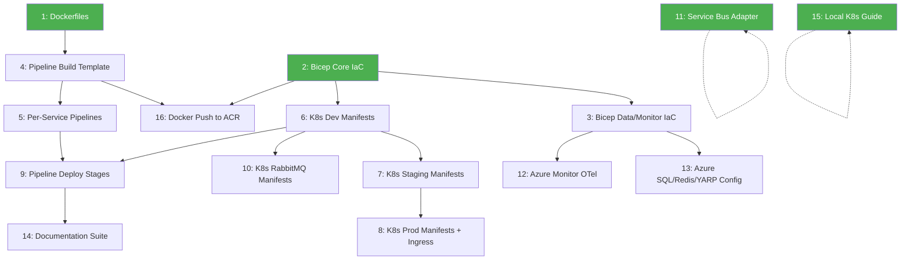

# Implementation Plan: Azure Cloud Infrastructure & Deployment

> **PRD**: [azure-infrastructure-deployment.md](../prd/azure-infrastructure-deployment.md)
> **Status**: Draft — Pending Review
> **Created**: 2026-04-29

---

## Overview

This plan breaks the Azure Infrastructure & Deployment PRD into 16 independently-implementable vertical slices. Each slice delivers a narrow but complete path through its integration layers, is verifiable on its own, and has clear acceptance criteria.

### Dependency Graph

> Green nodes can start immediately (no blockers).

---

## Slice 1: Production Dockerfiles for All Microservices

**Type**: AFK | **Blocked by**: None

### What to Build

Create production-ready multi-stage Dockerfiles for all 8 microservices. Each Dockerfile uses the .NET 10 SDK image for build/publish and the ASP.NET 10 runtime image for the final container. Build context is the repository root so that `shared-libs/`, `Directory.Build.props`, and `local-nuget-packages/` are accessible.

### Services

| Service | Dockerfile Location |
|---|---|
| Product | `product-microservice/Product.Service/Dockerfile` |
| Order | `order-microservice/Order.Service/Dockerfile` |
| Basket | `basket-microservice/Basket.Service/Dockerfile` |
| Inventory | `inventory-microservice/Inventory.Service/Dockerfile` |
| Shipping | `shipping-microservice/Shipping.Service/Dockerfile` |
| Payment | `payment-microservice/Payment.Service/Dockerfile` |
| Auth | `auth-microservice/Auth.Service/Dockerfile` |
| API Gateway | `api-gateway/ApiGateway/Dockerfile` |

### Acceptance Criteria

- [ ] Each of the 8 microservices has a multi-stage Dockerfile (SDK build → runtime image)
- [ ] Build context is the repo root (Dockerfiles reference paths relative to repo root)
- [ ] `shared-libs/ECommerce.Shared` and `Directory.Build.props` are available during build
- [ ] Each image builds successfully with `docker build -f <path>/Dockerfile .` from repo root
- [ ] Runtime images do not contain the .NET SDK (only ASP.NET runtime)
- [ ] Images support the `{branch}-{buildnumber}` and `{semver}` tagging convention
- [ ] Existing `docker-compose.yaml` continues to work (local dev unaffected)

### User Stories Covered

12, 13, 14

---

## Slice 2: Bicep IaC — VNet, AKS & ACR Provisioning

**Type**: AFK | **Blocked by**: None

### What to Build

Create Bicep templates to provision the foundational Azure infrastructure: Virtual Network with subnets, Azure Kubernetes Service (AKS) cluster, and Azure Container Registry (ACR). All templates are parameterized by environment (Dev/Staging/Prod) with separate parameter files.

### Deliverables

- `Infrastructure - Deployment/bicep/main.bicep` — orchestration file
- `Infrastructure - Deployment/bicep/modules/vnet.bicep` — VNet + subnets
- `Infrastructure - Deployment/bicep/modules/aks.bicep` — AKS cluster
- `Infrastructure - Deployment/bicep/modules/acr.bicep` — Container Registry
- `Infrastructure - Deployment/bicep/parameters/dev.bicepparam`
- `Infrastructure - Deployment/bicep/parameters/staging.bicepparam`
- `Infrastructure - Deployment/bicep/parameters/prod.bicepparam`

### Acceptance Criteria

- [ ] Bicep modules for VNet, AKS, and ACR are created and compile without errors (`az bicep build`)
- [ ] `main.bicep` orchestrates all modules and accepts environment-specific parameters
- [ ] Each environment has its own `.bicepparam` file with appropriate SKUs and sizes
- [ ] `az deployment group what-if` runs successfully against a target resource group
- [ ] AKS cluster is configured with a system node pool and attach to ACR for image pulling
- [ ] VNet has separate subnets for AKS nodes, and future services (SQL, Redis private endpoints)
- [ ] A single `az deployment group create` command provisions all core resources for one environment

### User Stories Covered

1, 2, 6, 10, 11

---

## Slice 3: Bicep IaC — Azure SQL, Redis, Key Vault, Monitor, Service Bus

**Type**: AFK | **Blocked by**: Slice 2

### What to Build

Extend the Bicep IaC to provision the remaining managed Azure services: Azure SQL Database (one per service), Azure Cache for Redis, Azure Key Vault, Azure Monitor / Log Analytics Workspace, Application Insights, and Azure Service Bus.

### Deliverables

- `Infrastructure - Deployment/bicep/modules/sql.bicep` — Azure SQL Server + databases
- `Infrastructure - Deployment/bicep/modules/redis.bicep` — Azure Cache for Redis
- `Infrastructure - Deployment/bicep/modules/keyvault.bicep` — Azure Key Vault
- `Infrastructure - Deployment/bicep/modules/monitor.bicep` — Log Analytics Workspace
- `Infrastructure - Deployment/bicep/modules/appinsights.bicep` — Application Insights
- `Infrastructure - Deployment/bicep/modules/servicebus.bicep` — Azure Service Bus namespace + topics
- Updated `main.bicep` to include all new modules
- Updated parameter files for each environment

### Acceptance Criteria

- [ ] Azure SQL Server with 6 databases (Auth, Order, Product, Inventory, Shipping, Payment) is provisioned
- [ ] Azure Cache for Redis is provisioned (shared instance for Basket and Order)
- [ ] Azure Key Vault is provisioned (for future use)
- [ ] Log Analytics Workspace and Application Insights resources are provisioned
- [ ] Azure Service Bus namespace with topics matching existing event types is provisioned
- [ ] All modules integrate into `main.bicep` and deploy via a single command
- [ ] `az deployment group what-if` validates successfully with all modules
- [ ] Connection strings and keys are output for consumption by K8s secrets / pipeline variables

### User Stories Covered

3, 4, 5, 7, 8, 9

---

## Slice 4: Azure Pipeline Build Stage Template (Shared)

**Type**: AFK | **Blocked by**: Slice 1

### What to Build

Create a shared Azure Pipeline template for the Build stage that all per-service pipelines will reference. The template handles: NuGet restore, `dotnet format` (lint), `dotnet build`, `dotnet test` (with Coverlet coverage), `dotnet publish`, Docker build, and Docker push to ACR.

### Deliverables

- `Infrastructure - Deployment/pipelines/templates/build-stage.yml`
- `Infrastructure - Deployment/pipelines/templates/deploy-stage.yml` (skeleton for Slice 9)

### Acceptance Criteria

- [ ] Shared build template accepts parameters: service name, project path, Dockerfile path, ACR name
- [ ] Template includes all build steps: NuGet restore, `dotnet format --verify-no-changes`, `dotnet build`, `dotnet test` with `--collect:"XPlat Code Coverage"`, `dotnet publish`
- [ ] Code coverage reports (Cobertura format) are published as pipeline artifacts
- [ ] Docker build and push steps are included (conditional on branch, not triggered on PRs)
- [ ] Image tagging follows `{branch}-{buildnumber}` convention
- [ ] Template uses Microsoft-hosted agents (`vmImage: 'ubuntu-latest'`)
- [ ] Template compiles/validates with `az pipelines run --dry-run` or equivalent

### User Stories Covered

16, 17, 18, 19

---

## Slice 5: Per-Service Azure Pipeline Definitions

**Type**: AFK | **Blocked by**: Slice 4

### What to Build

Create an `azure-pipelines.yml` file in each microservice directory that references the shared build template. Each pipeline is configured with the correct service-specific paths and triggers.

### Deliverables

- `product-microservice/azure-pipelines.yml`
- `order-microservice/azure-pipelines.yml`
- `basket-microservice/azure-pipelines.yml`
- `inventory-microservice/azure-pipelines.yml`
- `shipping-microservice/azure-pipelines.yml`
- `payment-microservice/azure-pipelines.yml`
- `auth-microservice/azure-pipelines.yml`
- `api-gateway/azure-pipelines.yml`

### Acceptance Criteria

- [ ] Each of the 8 services has its own `azure-pipelines.yml` in its directory
- [ ] Each pipeline references the shared build template via a `template` reference
- [ ] Each pipeline has correct path filters (triggers only on changes to its own directory + `shared-libs/`)
- [ ] PR triggers are configured for build+test validation
- [ ] Branch triggers are configured: `dev`, `staging`, `prod` branches
- [ ] Each pipeline specifies its service name, project path, and Dockerfile path as template parameters

### User Stories Covered

16

---

## Slice 6: AKS K8s Manifests — Dev Environment (All Services)

**Type**: AFK | **Blocked by**: Slice 2

### What to Build

Create Kubernetes manifests for deploying all 8 microservices to the Dev environment in AKS. Each service gets a Deployment (with probes, resource limits, env vars from secrets), a ClusterIP Service, and a HorizontalPodAutoscaler.

### Deliverables

- `Infrastructure - Deployment/kube/aks-dev-namespace.yml`
- `Infrastructure - Deployment/kube/aks-dev-product.yml`
- `Infrastructure - Deployment/kube/aks-dev-order.yml`
- `Infrastructure - Deployment/kube/aks-dev-basket.yml`
- `Infrastructure - Deployment/kube/aks-dev-inventory.yml`
- `Infrastructure - Deployment/kube/aks-dev-shipping.yml`
- `Infrastructure - Deployment/kube/aks-dev-payment.yml`
- `Infrastructure - Deployment/kube/aks-dev-auth.yml`
- `Infrastructure - Deployment/kube/aks-dev-api-gateway.yml`

### Acceptance Criteria

- [ ] Dev namespace manifest creates `ecommerce-dev` namespace
- [ ] Each service has a Deployment with: 1 replica, resource requests/limits, liveness probe (`/health/live`), readiness probe (`/health/ready`), container port 8080
- [ ] Environment variables are sourced from Kubernetes secrets (connection strings, JWT keys, App Insights, Redis, Service Bus)
- [ ] Each service has a ClusterIP Service on port 8080
- [ ] Each service has an HPA targeting 70% CPU, min 1 / max 3 replicas
- [ ] ACR image pull secret is referenced in the Deployment spec
- [ ] Manifests validate with `kubectl apply --dry-run=client`
- [ ] API Gateway YARP config references internal ClusterIP service addresses

### User Stories Covered

27, 28, 29, 30, 33

---

## Slice 7: AKS K8s Manifests — Staging Environment (All Services)

**Type**: AFK | **Blocked by**: Slice 6

### What to Build

Create Kubernetes manifests for the Staging environment by adapting the Dev manifests with Staging-specific configuration (separate namespace, potentially higher resource limits, different replica counts).

### Deliverables

- `Infrastructure - Deployment/kube/aks-staging-namespace.yml`
- `Infrastructure - Deployment/kube/aks-staging-{service}.yml` (8 files, one per service)

### Acceptance Criteria

- [ ] Staging namespace manifest creates `ecommerce-staging` namespace
- [ ] All manifests follow the same structure as Dev but with Staging-specific values
- [ ] Resource limits may differ from Dev (e.g., higher memory for data-heavy services)
- [ ] HPA scales min 1 / max 5 replicas
- [ ] Secrets reference Staging-specific environment variables
- [ ] Manifests validate with `kubectl apply --dry-run=client`

### User Stories Covered

27, 28, 29, 30, 33

---

## Slice 8: AKS K8s Manifests — Production Environment + Ingress

**Type**: AFK | **Blocked by**: Slice 7

### What to Build

Create Kubernetes manifests for the Production environment, including an Nginx Ingress Controller manifest with path-based routing to the API Gateway.

### Deliverables

- `Infrastructure - Deployment/kube/aks-prod-namespace.yml`
- `Infrastructure - Deployment/kube/aks-prod-{service}.yml` (8 files)
- `Infrastructure - Deployment/kube/aks-prod-ingress.yml`

### Acceptance Criteria

- [ ] Production namespace manifest creates `ecommerce-prod` namespace
- [ ] Resource limits are production-appropriate (higher than Staging)
- [ ] HPA scales min 2 / max 10 replicas
- [ ] Ingress manifest configures Nginx Ingress Controller with path-based routing to API Gateway
- [ ] Ingress routes external traffic through `/api/*` paths to the API Gateway ClusterIP service
- [ ] Manifests validate with `kubectl apply --dry-run=client`

### User Stories Covered

27, 28, 29, 30, 31, 33

---

## Slice 9: Pipeline Deployment Stages (Dev/Staging/Prod)

**Type**: AFK | **Blocked by**: Slice 5, Slice 6

### What to Build

Implement the deploy-stage template and add deployment stages to each per-service pipeline. Each deployment stage creates K8s secrets and deploys manifests with image substitution using `KubernetesManifest@0`.

### Deliverables

- Completed `Infrastructure - Deployment/pipelines/templates/deploy-stage.yml`
- Updated per-service `azure-pipelines.yml` files with Dev/Staging/Prod deployment stages

### Acceptance Criteria

- [ ] Deploy template accepts parameters: environment, AKS service connection, namespace, manifest path, image name, secrets
- [ ] Dev stage triggers on `dev` and `deploy/*` branches
- [ ] Staging stage triggers on `staging` branch
- [ ] Production stage triggers on `prod` branch
- [ ] Each stage creates K8s secrets: ACR pull secret, JWT keys, App Insights connection string, DB connection strings, Redis connection strings
- [ ] Each stage deploys manifests with `KubernetesManifest@0` and substitutes the container image tag
- [ ] Pipeline variables use environment prefixes (`DEV_`, `STAGING_`, `PROD_`)
- [ ] Optional manual approval gates are scaffolded (commented out) for Staging and Production
- [ ] Microsoft-hosted agents are used (`vmImage: 'ubuntu-latest'`)

### User Stories Covered

20, 21, 22, 23, 24, 25, 26, 45

---

## Slice 10: Infrastructure K8s Manifests (RabbitMQ)

**Type**: AFK | **Blocked by**: Slice 6

### What to Build

Create Kubernetes manifests for deploying RabbitMQ in AKS environments where Azure Service Bus is not used. This provides messaging infrastructure for Dev environments or any environment preferring RabbitMQ.

### Deliverables

- `Infrastructure - Deployment/kube/aks-dev-rabbitmq.yml`
- Optionally: `aks-staging-rabbitmq.yml` (if Staging uses RabbitMQ instead of Service Bus)

### Acceptance Criteria

- [ ] RabbitMQ Deployment with management plugin enabled
- [ ] RabbitMQ Service (ClusterIP) exposing AMQP (5672) and management (15672) ports
- [ ] Default credentials configurable via K8s secrets
- [ ] Persistent volume claim for message durability
- [ ] Resource requests/limits appropriate for messaging workload
- [ ] Manifests validate with `kubectl apply --dry-run=client`

### User Stories Covered

32

---

## Slice 11: Azure Service Bus Adapter for `IEventBus`

**Type**: AFK | **Blocked by**: None

### What to Build

Implement an Azure Service Bus adapter in `ECommerce.Shared` that implements the existing `IEventBus` interface. This allows services to switch between RabbitMQ and Azure Service Bus via configuration, without changing event handlers.

### Key Components

1. `AzureServiceBusEventBus` — implements `IEventBus` (publish/subscribe via Azure Service Bus topics)
2. `AzureServiceBusHostedService` — background service for subscription processing (mirrors `RabbitMqHostedService`)
3. `AzureServiceBusTelemetry` — OpenTelemetry context propagation through Service Bus messages
4. `AddAzureServiceBusEventBus()` — DI extension method for service registration
5. Configuration switch: `Messaging:Provider` → `RabbitMq` (default) or `AzureServiceBus`

### Acceptance Criteria

- [ ] `AzureServiceBusEventBus` implements `IEventBus.Publish<T>()` by sending messages to Azure Service Bus topics
- [ ] `AzureServiceBusHostedService` subscribes to topics and dispatches to registered `IEventHandler<T>` implementations
- [ ] `AzureServiceBusTelemetry` propagates trace context (TraceId, SpanId) through Service Bus message properties
- [ ] `Messaging:Provider` config switch selects the messaging provider at startup
- [ ] The same `Event` base type and handler registrations work with both providers
- [ ] Unit tests with mocked Azure Service Bus client validate publish/subscribe behavior
- [ ] Integration tests (optional, requires Service Bus connection) validate end-to-end flow
- [ ] Existing RabbitMQ functionality is unaffected (default provider remains `RabbitMq`)

### User Stories Covered

34, 35, 36, 37, 38

---

## Slice 12: Application Config — Azure Monitor OpenTelemetry Exporter

**Type**: AFK | **Blocked by**: Slice 3

### What to Build

Add the Azure Monitor OpenTelemetry exporter to `ECommerce.Shared` so that services can export traces, metrics, and logs to Application Insights when running in Azure. The exporter is switchable via environment variable.

### Key Changes

1. Add `Azure.Monitor.OpenTelemetry.Exporter` NuGet package to `ECommerce.Shared`
2. Update the OpenTelemetry configuration to conditionally add the Azure Monitor exporter
3. Configuration switch: `OpenTelemetry__Exporter` → `Otlp` (default) or `AzureMonitor`
4. Application Insights connection string via `APPLICATIONINSIGHTS_CONNECTION_STRING`

### Acceptance Criteria

- [ ] `Azure.Monitor.OpenTelemetry.Exporter` package is added to `ECommerce.Shared`
- [ ] OpenTelemetry setup conditionally adds Azure Monitor exporter when `OpenTelemetry__Exporter=AzureMonitor`
- [ ] Default behavior (local dev) is unchanged — OTLP exporter to Jaeger/OTel Collector still works
- [ ] Application Insights connection string is read from `APPLICATIONINSIGHTS_CONNECTION_STRING` env var
- [ ] Traces, metrics, and logs are exported to Application Insights when configured
- [ ] Existing OpenTelemetry instrumentation (HTTP, SQL, Redis, RabbitMQ) continues to work with both exporters
- [ ] No changes required in individual microservices — configuration is handled in the shared library

### User Stories Covered

41, 42

---

## Slice 13: Application Config — Azure SQL, Redis, YARP Cluster Addresses

**Type**: AFK | **Blocked by**: Slice 3

### What to Build

Validate and document that existing connection string patterns work with managed Azure services. Update the API Gateway YARP configuration to support K8s ClusterIP service addresses.

### Key Changes

1. Verify `ConnectionStrings__Default` pattern works for Azure SQL Database connection strings (with SSL/TLS)
2. Verify Redis connection strings support Azure Cache for Redis format (`host:port,password=xxx,ssl=True`)
3. Update API Gateway YARP `appsettings.json` to use environment variable overrides for cluster addresses
4. Validate health check endpoints work correctly for AKS probes

### Acceptance Criteria

- [ ] Azure SQL Database connection strings work via `ConnectionStrings__Default` env var (SSL enabled)
- [ ] Azure Cache for Redis connection strings work via existing Redis config (SSL, password, port)
- [ ] API Gateway YARP cluster addresses are overridable via environment variables for K8s deployment
- [ ] Health check endpoints `/health/live` and `/health/ready` respond correctly under AKS probe expectations
- [ ] No breaking changes to local development with Docker Compose

### User Stories Covered

39, 40, 43, 44

---

## Slice 14: Documentation — OVERVIEW, ARCHITECTURE, SYSTEM_DESIGN, TECH_STACK

**Type**: AFK | **Blocked by**: Slice 9

### What to Build

Write comprehensive documentation for the Azure infrastructure and deployment. These documents describe the cloud architecture, CI/CD flow, technology choices, and deployment process.

### Deliverables

- `Infrastructure - Deployment/docs/OVERVIEW.md` — Platform overview, environment structure, deployment model
- `Infrastructure - Deployment/docs/ARCHITECTURE.md` — Cloud architecture (AKS, ACR, Azure SQL, Redis, Service Bus, Monitor), network topology, service mesh
- `Infrastructure - Deployment/docs/SYSTEM_DESIGN.md` — End-to-end CI/CD flow (code push → build → test → Docker → deploy → AKS)
- `Infrastructure - Deployment/docs/TECH_STACK.md` — All Azure services, their purpose, and how they integrate
- `Infrastructure - Deployment/docs/Devops Agent Setup.md` — Future self-hosted agent migration guide
- Updated `README.md` with "Deployment" section

### Acceptance Criteria

- [ ] OVERVIEW.md explains the platform, environments (Dev/Staging/Prod), and deployment model
- [ ] ARCHITECTURE.md includes a diagram of the cloud architecture and network topology
- [ ] SYSTEM_DESIGN.md describes the complete CI/CD flow with pipeline stages
- [ ] TECH_STACK.md lists every Azure service, its purpose, and configuration
- [ ] Devops Agent Setup.md provides a migration path from Microsoft-hosted to self-hosted agents
- [ ] README.md has a "Deployment" section linking to the documentation
- [ ] All documents are free of confidential or proprietary references

### User Stories Covered

51, 52, 53, 54, 55, 56

---

## Slice 15: Documentation — Local Kubernetes Practice Guide

**Type**: AFK | **Blocked by**: None

### What to Build

Create a step-by-step guide for running the microservices platform on local Kubernetes (Docker Desktop Kubernetes or Minikube). This validates that K8s manifests work before pushing to AKS.

### Deliverables

- `Infrastructure - Deployment/docs/LOCAL_K8S_GUIDE.md`

### Acceptance Criteria

- [ ] Step-by-step instructions for enabling Kubernetes in Docker Desktop
- [ ] Step-by-step instructions for using Minikube as an alternative
- [ ] Guide for deploying all services to local K8s using existing `kubernetes/` manifests
- [ ] Troubleshooting section for common local K8s issues
- [ ] Verification steps (health checks, API requests) to confirm successful deployment
- [ ] Guide explains the difference between local K8s manifests (`kubernetes/`) and AKS manifests (`kube/`)

### User Stories Covered

48, 49, 50

---

## Slice 16: Docker Push to ACR in Pipeline

**Type**: AFK | **Blocked by**: Slice 4, Slice 2

### What to Build

Ensure the pipeline build template correctly pushes Docker images to Azure Container Registry. This connects the Docker build output to ACR and makes images available for AKS deployment.

### Key Changes

1. Add ACR login step (`Docker@2` task with `command: login`)
2. Configure Docker push with correct ACR endpoint and image naming
3. Apply image tagging convention: `{acr-name}.azurecr.io/{service}:{branch}-{buildnumber}`

### Acceptance Criteria

- [ ] Pipeline template includes ACR login via `Docker@2` task
- [ ] Docker images are pushed to ACR after successful build
- [ ] Image naming follows `{acr-name}.azurecr.io/{service-name}:{tag}` convention
- [ ] Push only occurs on branch builds (not on PR validation builds)
- [ ] ACR credentials are managed via Azure DevOps service connection (not hardcoded)
- [ ] Pipeline variable for ACR name is parameterized per environment

### User Stories Covered

15

---

## Implementation Order (Recommended)

The following execution order respects dependencies and optimizes for learning:

### Wave 1 — Foundation (No dependencies, start immediately)

| Slice | Title | Est. Effort |
|---|---|---|
| 1 | Production Dockerfiles | Medium |
| 2 | Bicep IaC: VNet, AKS, ACR | Large |
| 11 | Azure Service Bus Adapter | Large |
| 15 | Local K8s Guide | Small |

### Wave 2 — Build on Foundation

| Slice | Title | Depends On | Est. Effort |
|---|---|---|---|
| 3 | Bicep IaC: SQL, Redis, KV, Monitor, SB | 2 | Large |
| 4 | Pipeline Build Template | 1 | Medium |
| 6 | K8s Dev Manifests | 2 | Medium |

### Wave 3 — Pipeline & Environments

| Slice | Title | Depends On | Est. Effort |
|---|---|---|---|
| 5 | Per-Service Pipeline Definitions | 4 | Small |
| 7 | K8s Staging Manifests | 6 | Small |
| 10 | K8s RabbitMQ Manifests | 6 | Small |
| 16 | Docker Push to ACR | 4, 2 | Small |

### Wave 4 — Deployment & Config

| Slice | Title | Depends On | Est. Effort |
|---|---|---|---|
| 8 | K8s Prod Manifests + Ingress | 7 | Medium |
| 9 | Pipeline Deploy Stages | 5, 6 | Large |
| 12 | Azure Monitor OTel Exporter | 3 | Medium |
| 13 | Azure SQL/Redis/YARP Config | 3 | Small |

### Wave 5 — Documentation

| Slice | Title | Depends On | Est. Effort |
|---|---|---|---|
| 14 | Documentation Suite | 9 | Medium |
