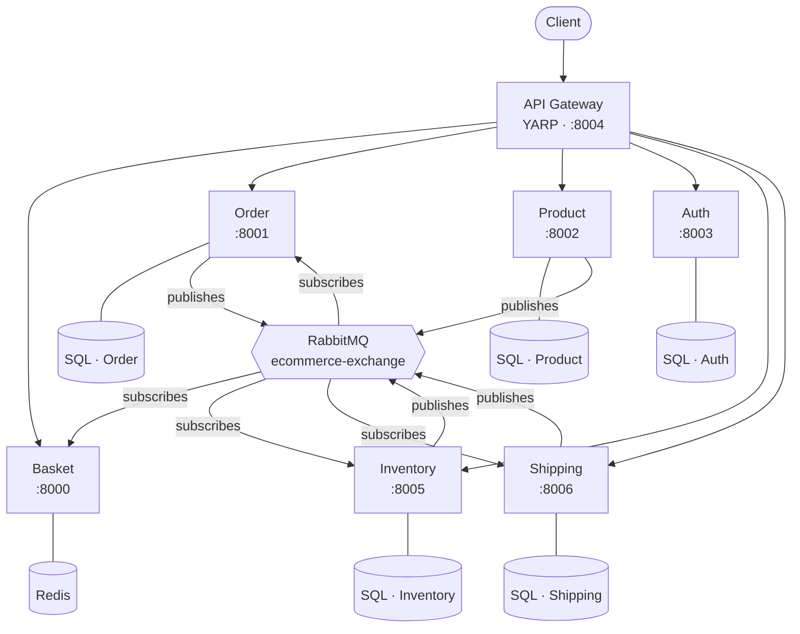
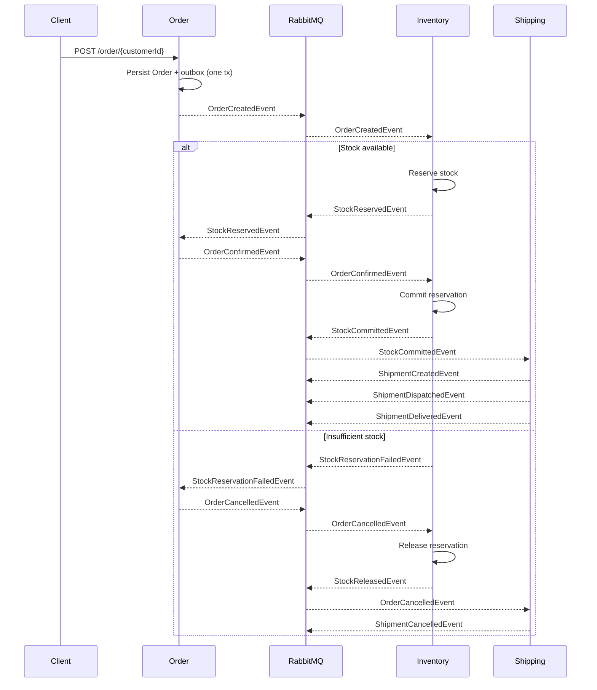
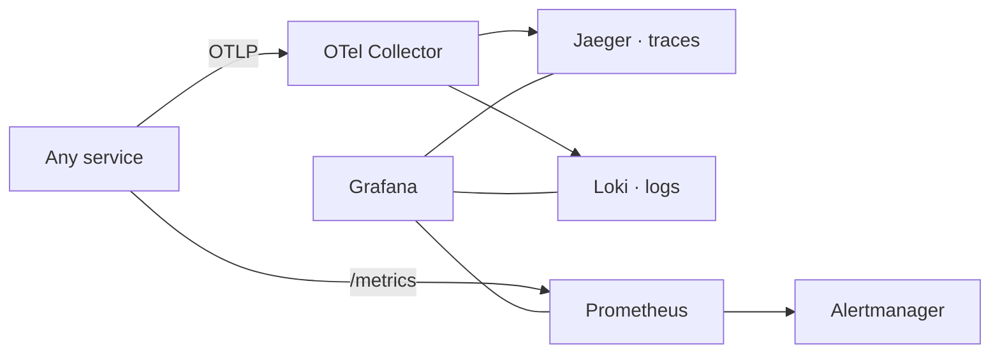

# Architecture

The platform decomposes an e-commerce domain into six independently deployable services. Each service owns its data, communicates with the outside world through the API Gateway, and with other services through asynchronous events on a RabbitMQ fanout exchange.

## High-level topology

## Core design rules

| Rule | Why |
|---|---|
| **Per-service datastore** | Services deploy, scale, and evolve their schemas independently. No shared databases. |
| **Event-driven cross-service communication** | Services publish domain events to a fanout exchange; subscribers react. No synchronous service-to-service HTTP. |
| **Transactional Outbox** | Each service writes business state and the outbound event record in one DB transaction; a background service publishes from the outbox. This prevents the "event published but DB rolled back" or "DB committed but event lost" failure modes. |
| **API Gateway owns public auth** | JWT validation and role checks happen at the gateway. Downstream services still validate the token but trust the gateway for routing. |
| **DTO vs Domain separation** | `ApiModels/` holds request/response DTOs; `Models/` holds internal domain entities. |
| **Shared cross-cutting library** | `ECommerce.Shared` centralizes JWT, EventBus, Outbox, Observability, Health — see [Shared-Library](Shared-Library). |

## Saga: Order ↔ Inventory ↔ Shipping

Order, Inventory, and Shipping coordinate via a choreographed saga. Each participant reacts to events and emits its own.

The full event catalog lives in [Integration-Events](Integration-Events).

## Observability flow

See [Observability](Observability) for dashboards and alerts.

## Authentication flow

1. Client calls `POST /login` on the Gateway → proxied to Auth service.
2. Auth validates credentials against its SQL Server store and returns a JWT (HMAC-SHA256) with `user_role` claims.
3. Client includes `Authorization: Bearer <jwt>` on subsequent requests.
4. The Gateway validates the token and enforces role policies (e.g. `Administrator` for write ops on Product and Inventory).
5. Downstream services validate the token again via the shared `AddJwtAuthentication()` extension.

See [Service-Auth](Service-Auth) and [Service-API-Gateway](Service-API-Gateway).

## References

- Repo: [README](https://github.com/daonhan/Microservices-in-.NET#architecture)
- Existing PRDs: [`docs/prd/`](https://github.com/daonhan/Microservices-in-.NET/tree/main/docs/prd)
- Implementation plans: [`docs/plans/`](https://github.com/daonhan/Microservices-in-.NET/tree/main/docs/plans)
