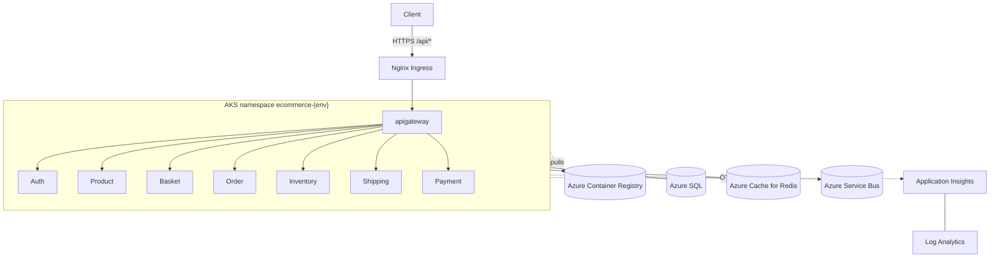

# Azure Deployment

The platform deploys to **Microsoft Azure** on AKS with a per-service Azure Pipelines CI/CD flow. This page is the wiki entry point; the authoritative narrative lives in [`Infrastructure - Deployment/docs/`](https://github.com/daonhan/Microservices-in-.NET/tree/main/Infrastructure%20-%20Deployment/docs).

Tracked under [Epic #33 — Azure Cloud Infrastructure & Deployment](https://github.com/daonhan/Microservices-in-.NET/issues/33). All 16 implementation slices are merged.

## Topology



## Environments

| Environment | Namespace           | Branch trigger    | Agent pool       | Replicas (min/max) |
|-------------|---------------------|-------------------|------------------|--------------------|
| Dev         | `ecommerce-dev`     | `dev`, `deploy/*` | Microsoft-hosted | 1 / 3              |
| Staging     | `ecommerce-staging` | `staging`         | Self-hosted      | 1 / 5              |
| Production  | `ecommerce-prod`    | `prod`            | Self-hosted      | 2 / 10             |

Same Bicep templates, same Kubernetes manifests, parameterized per env. Manifests live in [`kubernetes/`](https://github.com/daonhan/Microservices-in-.NET/tree/main/kubernetes) under `aks-dev-*.yml`, `aks-staging-*.yml`, `aks-prod-*.yml`.

## Infrastructure as Code (Bicep)

[`Infrastructure - Deployment/bicep/`](https://github.com/daonhan/Microservices-in-.NET/tree/main/Infrastructure%20-%20Deployment/bicep) provisions everything:

| Module | Resource |
|---|---|
| `vnet.bicep` | VNet + subnets (AKS, private endpoints, agents) |
| `acr.bicep` + `acr-pull-role.bicep` | ACR with `AcrPull` granted to AKS kubelet identity |
| `aks.bicep` | AKS cluster (system-assigned MI, Azure CNI) |
| `sql.bicep` | Azure SQL — one DB per service (Auth, Order, Product, Inventory, Shipping, Payment) |
| `redis.bicep` | Azure Cache for Redis (Basket, Order) |
| `servicebus.bicep` | Azure Service Bus namespace + topics |
| `keyvault.bicep` | Per-environment Key Vault |
| `monitor.bicep` + `appinsights.bicep` | Log Analytics + Application Insights |

Deploy with:

```bash
ENV=dev
RG=rg-ecommerce-${ENV}-eastus
az group create --name "$RG" --location eastus
az deployment group create -g "$RG" \
  --template-file "Infrastructure - Deployment/bicep/main.bicep" \
  --parameters "Infrastructure - Deployment/bicep/parameters/${ENV}.bicepparam"
```

## CI/CD (Azure Pipelines)

Each microservice has its own `azure-pipelines.yml` that `extends` shared templates in [`Infrastructure - Deployment/pipelines/templates/`](https://github.com/daonhan/Microservices-in-.NET/tree/main/Infrastructure%20-%20Deployment/pipelines/templates):

- **`build-stage.yml`** — `dotnet restore` → `format --verify-no-changes` → `build` → `test` (Cobertura) → `publish` → `docker build` → `docker push` to ACR. Image tag = `<branch>-<buildnumber>` or the git tag verbatim. `latest` is intentionally not used.
- **`deploy-stage.yml`** — login to AKS → create K8s secrets from pipeline variables (`DEV_*`, `STAGING_*`, `PROD_*`) → `KubernetesManifest@0 deploy` with the freshly built image tag substituted into `aks-<env>-<service>.yml`.

Branching:

```
feature/* ─PR─► dev      → Dev deploy
deploy/*       ─► dev    → Dev deploy (ad-hoc)
dev       ─PR─► staging  → Staging deploy (approval gate)
staging   ─PR─► prod     → Prod deploy (approval gate)
```

Approval gates are configured on the Azure DevOps **Environment** (`ecommerce-staging`, `ecommerce-prod`) — no pipeline change needed to add reviewers.

## Provider switches

Two cloud-vs-local switches are first-class config:

| Switch | Values | Effect |
|---|---|---|
| `Messaging__Provider` | `RabbitMq` (default) · `AzureServiceBus` | Selects `RabbitMqEventBus` or `AzureServiceBusEventBus` from `ECommerce.Shared`. Same `IEventBus`, same handlers. |
| `OpenTelemetry__Exporter` | `Otlp` (default) · `AzureMonitor` | Routes traces/metrics/logs to local Jaeger/Prom/Loki **or** Application Insights via `Azure.Monitor.OpenTelemetry.Exporter`. |

OTel context propagates through Service Bus messages (`AzureServiceBusTelemetry`), so the Order ↔ Inventory ↔ Payment ↔ Shipping saga remains traceable end-to-end in Application Insights.

## Cloud configuration sources

| Setting | Source in cloud |
|---|---|
| `ConnectionStrings__Default` | K8s secret (from pipeline variable) |
| `Redis__Configuration` | K8s secret |
| `Jwt:Key` | K8s secret |
| `APPLICATIONINSIGHTS_CONNECTION_STRING` | K8s secret |
| `Messaging:Provider`, `OpenTelemetry:Exporter` | Per-deployment env var on the manifest |
| YARP cluster destinations | `appsettings.json` defaults; overridable via `Gateway__ClusterAddresses__<Service>` |

## Authoritative docs

| Doc | What it covers |
|---|---|
| [`OVERVIEW.md`](https://github.com/daonhan/Microservices-in-.NET/blob/main/Infrastructure%20-%20Deployment/docs/OVERVIEW.md) | Topology summary and where things live |
| [`ARCHITECTURE.md`](https://github.com/daonhan/Microservices-in-.NET/blob/main/Infrastructure%20-%20Deployment/docs/ARCHITECTURE.md) | Cloud architecture, network, data plane, observability |
| [`SYSTEM_DESIGN.md`](https://github.com/daonhan/Microservices-in-.NET/blob/main/Infrastructure%20-%20Deployment/docs/SYSTEM_DESIGN.md) | End-to-end CI/CD flow with stage details |
| [`TECH_STACK.md`](https://github.com/daonhan/Microservices-in-.NET/blob/main/Infrastructure%20-%20Deployment/docs/TECH_STACK.md) | Every Azure service, purpose, integration point |
| [`Devops Agent Setup.md`](https://github.com/daonhan/Microservices-in-.NET/blob/main/Infrastructure%20-%20Deployment/docs/Devops%20Agent%20Setup.md) | Microsoft-hosted vs self-hosted agent guidance |
| [`LOCAL_K8S_GUIDE.md`](https://github.com/daonhan/Microservices-in-.NET/blob/main/docs/LOCAL_K8S_GUIDE.md) | Practising K8s manifests locally before AKS |
| [PRD #34](https://github.com/daonhan/Microservices-in-.NET/issues/34) · [Plan #35](https://github.com/daonhan/Microservices-in-.NET/issues/35) | Source-of-truth requirements and slice plan |

For applying manifests locally (Docker Desktop / Minikube), see [Kubernetes-Deployment](Kubernetes-Deployment).
