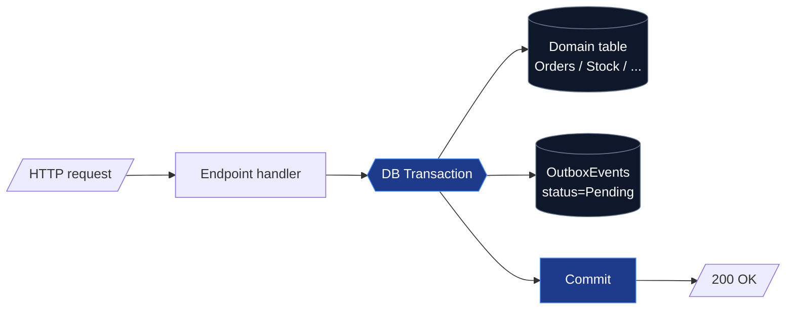
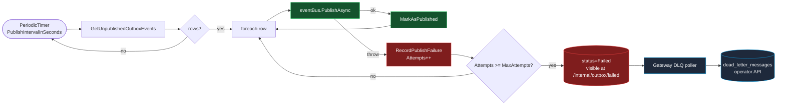
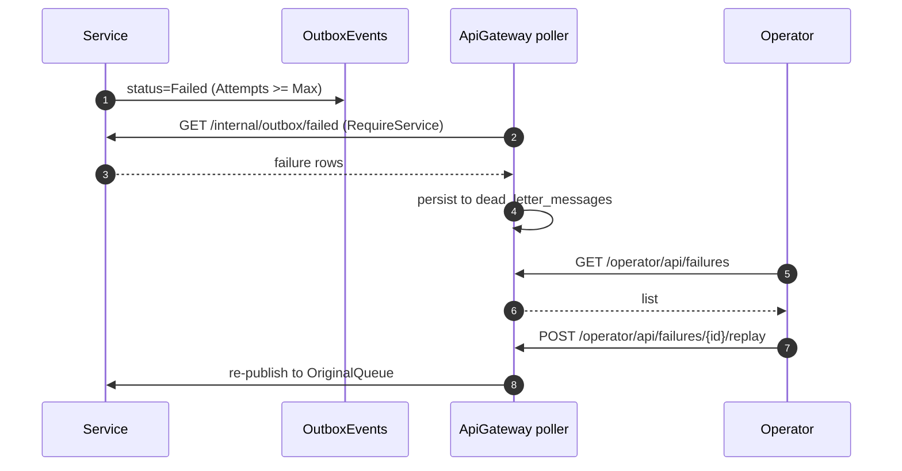

# Transactional outbox

At-least-once publish. Domain write + event row commit in one DB transaction. Background poller drains. See [ADR-0002](https://github.com/daonhan/Microservices-in-.NET/blob/main/docs/adr/0002-transactional-outbox-per-publishing-service.md).

## Write path (sync, inside HTTP request)

## Publish path (async, OutboxBackgroundService)

## Failure recovery loop

## Source

- [`shared-libs/.../Outbox/OutboxBackgroundService.cs`](https://github.com/daonhan/Microservices-in-.NET/blob/main/shared-libs/ECommerce.Shared/Infrastructure/Outbox/OutboxBackgroundService.cs) — poller loop
- [`shared-libs/.../Outbox/OutboxContext.cs`](https://github.com/daonhan/Microservices-in-.NET/blob/main/shared-libs/ECommerce.Shared/Infrastructure/Outbox/OutboxContext.cs) — EF schema
- [`api-gateway/.../OutboxPolling/OutboxFailurePoller.cs`](https://github.com/daonhan/Microservices-in-.NET/blob/main/api-gateway/ApiGateway/Operator/OutboxPolling/OutboxFailurePoller.cs) — gateway-side ingest
