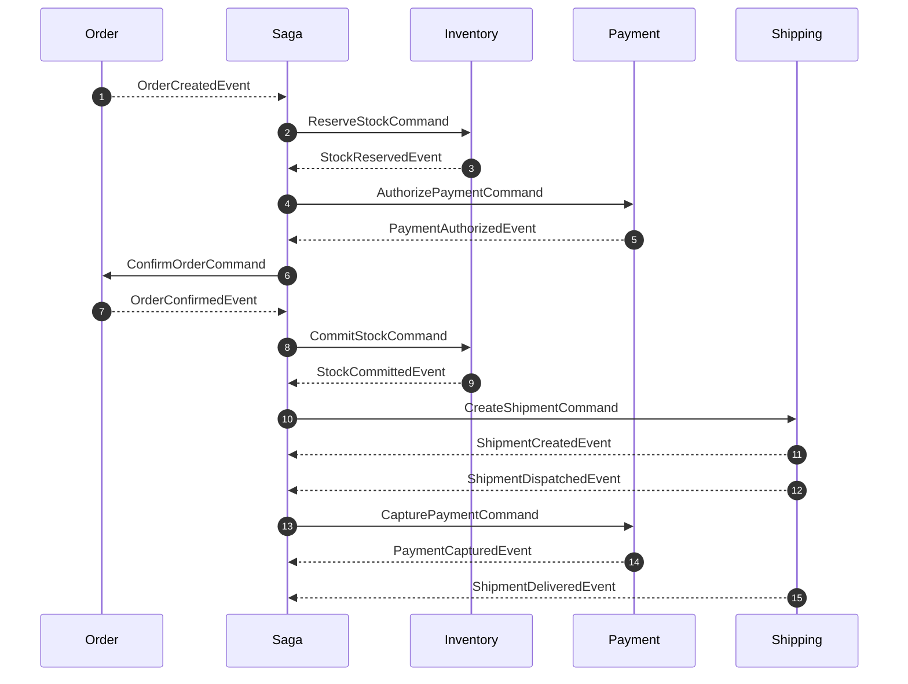
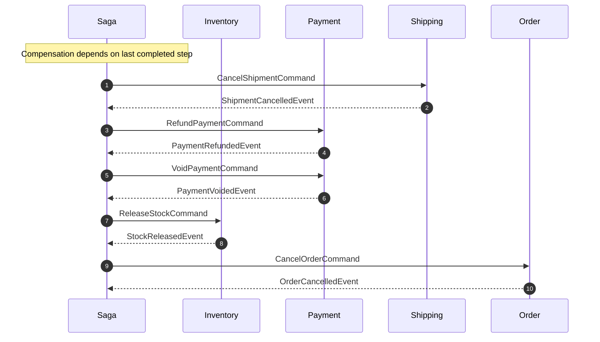

# Saga overview — order fulfillment

The order saga is orchestrated by the [Saga service](Service-Saga) (`:8008`). Saga subscribes to `OrderCreatedEvent`, persists saga state, and drives Order, Inventory, Payment, and Shipping by sending commands. Participants execute the commands against their own datastore and publish reply integration events back to Saga, which carry `SagaId` and `CausationId`. See [ADR-0010](https://github.com/daonhan/Microservices-in-.NET/blob/main/docs/adr/0010-saga-orchestrator-supersedes-choreography.md) and the [strangler runbook](https://github.com/daonhan/Microservices-in-.NET/blob/main/docs/runbooks/saga-orchestrator-strangler.md).

## Happy path (canonical sequence)

## Compensation (orchestrator-issued reverse commands)

Saga drives the reverse path based on the last completed step. Each command targets the participant that owns the state being undone.

`RefundPaymentCommand` is issued when payment was already captured; `VoidPaymentCommand` is issued when payment was only authorized. `CancelShipmentCommand` is skipped if no shipment was created. `ReleaseStockCommand` is skipped if stock was never reserved.

## Notes

- All commands and reply events flow through the same broker path as integration events (RabbitMQ fanout `ecommerce-exchange` by default, Azure Service Bus when `Messaging:Provider=AzureServiceBus`). See [ADR-0004](https://github.com/daonhan/Microservices-in-.NET/blob/main/docs/adr/0004-rabbitmq-fanout-with-dlq-and-operator-api.md).
- Saga writes state changes and outgoing commands in the same `IOutboxUnitOfWork.ExecuteAsync` envelope (see [ADR-0002](https://github.com/daonhan/Microservices-in-.NET/blob/main/docs/adr/0002-transactional-outbox-per-publishing-service.md)).
- For the command catalog and event ⇄ service matrix, see [Integration-Events](Integration-Events).
