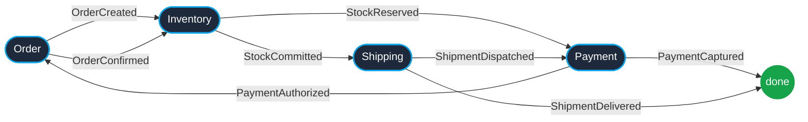
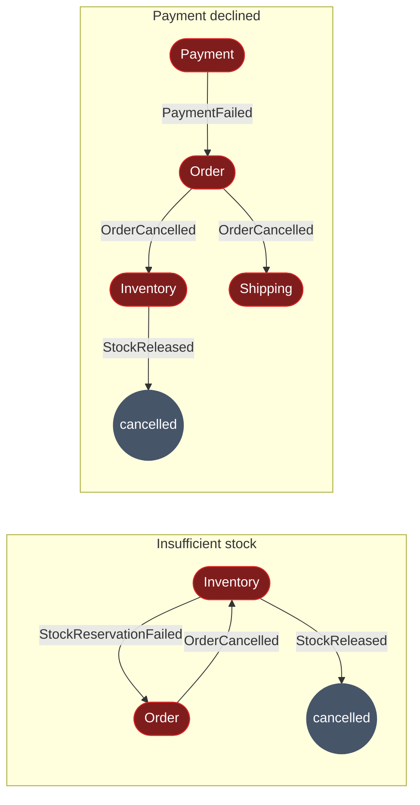
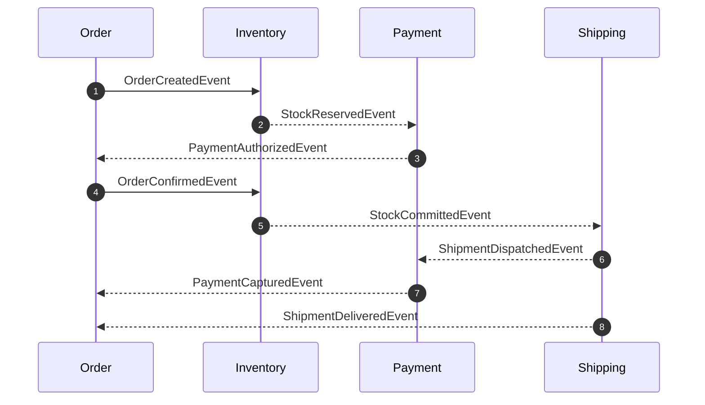

# Saga overview — order fulfillment

Choreography (no orchestrator). Each service reacts to upstream events. See [ADR-0008](https://github.com/daonhan/Microservices-in-.NET/blob/main/docs/adr/0008-saga-choreography-no-central-orchestrator.md). Detailed alt-branch sequence: [Integration-Events](Integration-Events#saga-and-fulfillment-sequence).

## Happy path (event hops)

## Compensations

## End-to-end sequence (happy path)

> Bus omitted for clarity. All hops go through RabbitMQ fanout `ecommerce-exchange`. See [ADR-0004](https://github.com/daonhan/Microservices-in-.NET/blob/main/docs/adr/0004-rabbitmq-fanout-with-dlq-and-operator-api.md).
