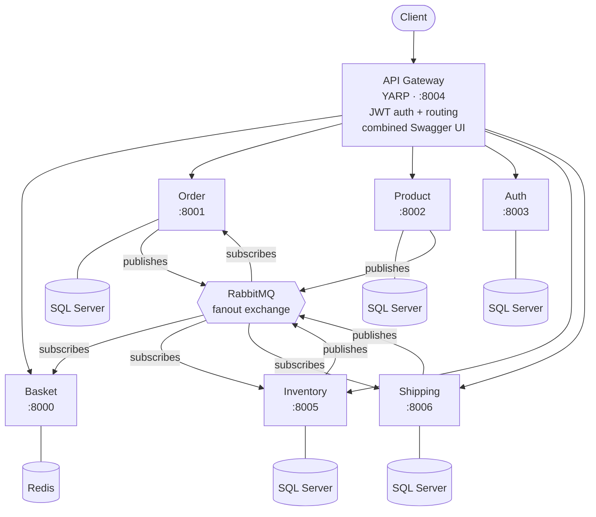

# E-Commerce Microservices Platform — Wiki

Welcome to the reference wiki for the **E-Commerce Microservices Platform**, a production-ready .NET 8 microservice reference implementation. This wiki is the canonical narrative layer over the source code.

If you just want to clone and run it, see the repository [README](https://github.com/daonhan/Microservices-in-.NET#getting-started). The wiki is organized around how people actually encounter the system.

## Architecture at a glance

See [Architecture](Architecture) for the full story.

## Where to go next

| I want to... | Start here |
|---|---|
| Run the platform locally | [Getting-Started](Getting-Started) |
| Understand the design | [Architecture](Architecture) |
| Learn one service | [Service-Basket](Service-Basket) · [Service-Order](Service-Order) · [Service-Product](Service-Product) · [Service-Auth](Service-Auth) · [Service-Inventory](Service-Inventory) · [Service-Shipping](Service-Shipping) · [Service-API-Gateway](Service-API-Gateway) |
| Try the API in a browser | Combined Swagger UI at `http://localhost:8004/swagger` (dev/staging only) |
| See all HTTP endpoints | [API-Reference](API-Reference) |
| Trace cross-service events | [Integration-Events](Integration-Events) |
| Learn the shared building blocks | [Shared-Library](Shared-Library) |
| Write tests the house way | [Testing](Testing) |
| Watch it in production | [Observability](Observability) |
| Deploy to Kubernetes | [Kubernetes-Deployment](Kubernetes-Deployment) |
| Contribute a change | [Contributing](Contributing) |
| Diagnose a problem | [Troubleshooting](Troubleshooting) |
| See what's next | [Roadmap](Roadmap) |

## Tech stack summary

- **.NET 8**, ASP.NET Core Minimal APIs, C# 12
- **RabbitMQ** fanout exchange for async events
- **EF Core + SQL Server** per service; **Redis** for Basket
- **YARP** API Gateway (Ocelot retained as runtime-switchable fallback)
- **OpenTelemetry** → Jaeger (traces), Prometheus (metrics), Loki (logs), Grafana (dashboards), Alertmanager
- **xUnit + NSubstitute + WebApplicationFactory** for tests
- **Docker Compose** and **Kubernetes** manifests for deployment
