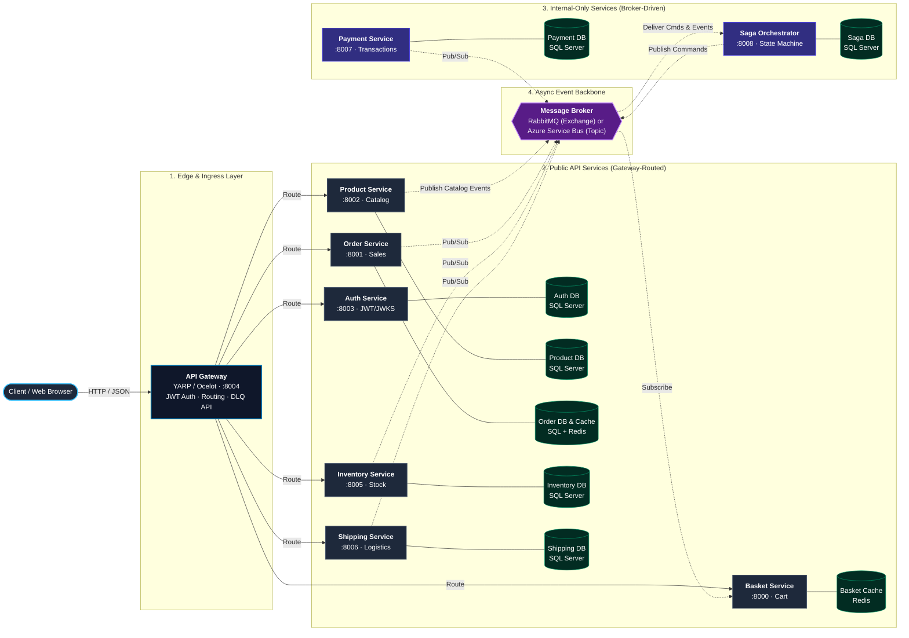

# E-Commerce Microservices Platform — Wiki

Welcome to the reference wiki for the **E-Commerce Microservices Platform**, a production-ready, high-performance .NET 10 microservice reference implementation. This wiki serves as the canonical narrative and architectural guide over the source code.

> [!TIP]
> If you are looking to clone, build, and run the platform immediately, check out the repository [README](https://github.com/daonhan/Microservices-in-.NET#getting-started).

---

## 🏗️ Architecture at a Glance

The platform utilizes a **Database-per-Service** pattern with a YARP-backed API Gateway at the edge and a robust asynchronous event backbone for cross-service collaboration.

```mermaid
flowchart LR
    Client([Client / Web Browser]) -->|HTTP / JSON| GW

    subgraph Edge ["1. Edge & Ingress Layer"]
        GW["<strong>API Gateway</strong><br/>YARP / Ocelot · :8004<br/>JWT Auth · Routing · DLQ API"]
    end

    subgraph PublicServices ["2. Public API Services (Gateway-Routed)"]
        direction TB
        Auth["<strong>Auth Service</strong><br/>:8003 · JWT/JWKS"] --- DB_Auth[("Auth DB<br/>SQL Server")]
        Product["<strong>Product Service</strong><br/>:8002 · Catalog"] --- DB_Product[("Product DB<br/>SQL Server")]
        Basket["<strong>Basket Service</strong><br/>:8000 · Cart"] --- DB_Basket[("Basket Cache<br/>Redis")]
        Order["<strong>Order Service</strong><br/>:8001 · Sales"] --- DB_Order[("Order DB & Cache<br/>SQL + Redis")]
        Inventory["<strong>Inventory Service</strong><br/>:8005 · Stock"] --- DB_Inventory[("Inventory DB<br/>SQL Server")]
        Shipping["<strong>Shipping Service</strong><br/>:8006 · Logistics"] --- DB_Shipping[("Shipping DB<br/>SQL Server")]
    end

    subgraph InternalServices ["3. Internal-Only Services (Broker-Driven)"]
        direction TB
        Saga["<strong>Saga Orchestrator</strong><br/>:8008 · State Machine"] --- DB_Saga[("Saga DB<br/>SQL Server")]
        Payment["<strong>Payment Service</strong><br/>:8007 · Transactions"] --- DB_Payment[("Payment DB<br/>SQL Server")]
    end

    subgraph EventBackbone ["4. Async Event Backbone"]
        Broker{{"<strong>Message Broker</strong><br/>RabbitMQ (Exchange) or Azure Service Bus (Topic)"}}
    end

    %% Gateway Routing
    GW -->|Route| Auth
    GW -->|Route| Product
    GW -->|Route| Basket
    GW -->|Route| Order
    GW -->|Route| Inventory
    GW -->|Route| Shipping

    %% Service Integration via Broker
    Product -.->|Publish Catalog Events| Broker
    Broker -.->|Subscribe| Basket
    
    %% Saga Orchestration Loop (Logical Flow through Broker)
    Saga -.->|Publish Commands| Broker
    Order -.->|Pub/Sub| Broker
    Inventory -.->|Pub/Sub| Broker
    Payment -.->|Pub/Sub| Broker
    Shipping -.->|Pub/Sub| Broker
    Broker -.->|Deliver Cmds & Events| Saga

    %% Premium Aesthetics styling
    classDef client fill:#1e293b,stroke:#38bdf8,stroke-width:2px,color:#fff;
    classDef gateway fill:#0f172a,stroke:#0284c7,stroke-width:2px,color:#fff;
    classDef pubService fill:#1e293b,stroke:#475569,stroke-width:1.5px,color:#fff;
    classDef intService fill:#312e81,stroke:#4f46e5,stroke-width:1.5px,color:#fff;
    classDef database fill:#022c22,stroke:#059669,stroke-width:1px,color:#fff;
    classDef broker fill:#581c87,stroke:#c084fc,stroke-width:2px,color:#fff;

    class Client client;
    class GW gateway;
    class Auth,Product,Basket,Order,Inventory,Shipping pubService;
    class Saga,Payment intService;
    class DB_Auth,DB_Product,DB_Basket,DB_Order,DB_Inventory,DB_Shipping,DB_Saga,DB_Payment database;
    class Broker broker;
```

> [!NOTE]
> All services own their respective datastores to guarantee loose coupling. Cross-service state synchronization is strictly event-driven. For a deep dive into our design principles, see the [Architecture](Architecture) page.

---

## 🗺️ Developer Navigation Map

Choose your path to explore the platform's features, implementation details, and operations.

### 🚀 Getting Started & DevOps
*   **Run Locally:** [Getting-Started](Getting-Started) — Prerequisites, Docker Compose, and first run.
*   **Local Kubernetes:** [Local-Kubernetes-Guide](Local-Kubernetes-Guide) — Deploying to Minikube or Docker Desktop.
*   **Production Kubernetes:** [Kubernetes-Deployment](Kubernetes-Deployment) — Config maps, secrets, and services.
*   **Azure Cloud Deployment:** [Azure-Deployment](Azure-Deployment) — AKS, Azure Service Bus, Bicep templates, and Azure Pipelines CI/CD.
*   **Contribution Guide:** [Contributing](Contributing) — Code style, pull request guidelines, and workflow.

### 🧠 Core Architecture & Flows
*   **Architectural Design:** [Architecture](Architecture) — Clean Architecture, Vertical Slices, and Service boundaries.
*   **Saga Orchestration:** [Service-Saga](Service-Saga) & [Diagram-Saga](Diagram-Saga) — Order fulfillment and compensation flows.
*   **Transactional Outbox:** [Diagram-Outbox](Diagram-Outbox) — Reliable messaging pattern details.
*   **Event Catalog:** [Integration-Events](Integration-Events) — List of cross-service payloads, commands, and events.
*   **API Reference:** [API-Reference](API-Reference) — Comprehensive list of public and internal HTTP endpoints.
*   **Try the API:** Combined Swagger UI at `http://localhost:8004/swagger` (Development and Staging environments).

### 🧩 Shared Foundations & Quality
*   **Shared Building Blocks:** [Shared-Library](Shared-Library) — The 9 core capability packages (`ECommerce.Shared.*`).
*   **Testing Philosophy:** [Testing](Testing) — Unit, integration, and E2E testing standard practices.
*   **Observability:** [Observability](Observability) — Distributed tracing, metrics, and logs with Grafana, Jaeger, and Prometheus.
*   **Troubleshooting:** [Troubleshooting](Troubleshooting) — Solutions for common local and deployment issues.
*   **Roadmap:** [Roadmap](Roadmap) — Future milestones and upcoming features.

### 📦 Microservices Catalog

Discover the dedicated responsibilities, endpoints, and architectures of each microservice.

| Service | Responsibility | Port | Datastore | Link |
| :--- | :--- | :--- | :--- | :--- |
| **API Gateway** | YARP Ingress, Central Auth, Combined Swagger, DLQ API | `:8004` | SQL Server | [Service-API-Gateway](Service-API-Gateway) |
| **Auth** | RS256 JWKS, User Login, Service Tokens | `:8003` | SQL Server | [Service-Auth](Service-Auth) |
| **Basket** | Shopping Cart CRUD, Price Caching | `:8000` | Redis | [Service-Basket](Service-Basket) |
| **Product** | Product Catalog API | `:8002` | SQL Server | [Service-Product](Service-Product) |
| **Order** | Checkout, Sales Coordination, Outbox Seam | `:8001` | SQL Server + Redis | [Service-Order](Service-Order) |
| **Saga** | Orchestrator of Order and Refund Workflows | `:8008` | SQL Server | [Service-Saga](Service-Saga) |
| **Inventory** | Stock Reservations, Backorders, Low-stock Checks | `:8005` | SQL Server | [Service-Inventory](Service-Inventory) |
| **Payment** | Multi-producer Transactions (Authorize, Capture, Refund) | `:8007` | SQL Server | [Service-Payment](Service-Payment) |
| **Shipping** | Shipment Creation, Carriers, Delivery Status Tracking | `:8006` | SQL Server | [Service-Shipping](Service-Shipping) |

---

## 🛠️ Tech Stack & Capabilities

*   **Runtime Framework:** **.NET 10**, ASP.NET Core Minimal APIs, and C# 14.
*   **Patterns:** Clean Architecture & Vertical Slices, Transactional Outbox, Saga Orchestrator, and Provider-Agnostic DLQ.
*   **Messaging System:** Flexible provider model supporting **RabbitMQ** (local/default) and **Azure Service Bus** (production).
*   **Observability:** OpenTelemetry (OTLP), Prometheus metrics, Loki logs, and Grafana dashboards.
*   **Quality Assurance:** Pre-commit hooks via **Husky.Net**, unit and integration tests using xUnit, NSubstitute, and WebApplicationFactory.
