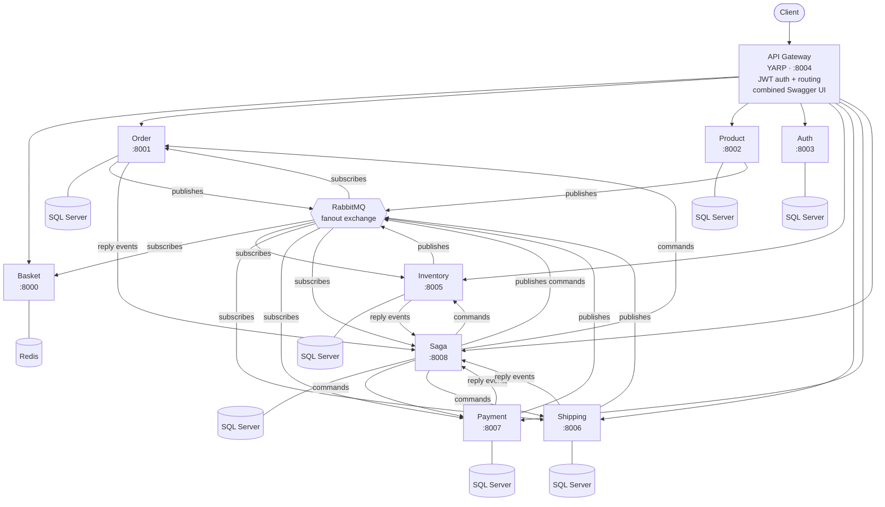

# E-Commerce Microservices Platform — Wiki

Welcome to the reference wiki for the **E-Commerce Microservices Platform**, a production-ready .NET 10 microservice reference implementation. This wiki is the canonical narrative layer over the source code.

If you just want to clone and run it, see the repository [README](https://github.com/daonhan/Microservices-in-.NET#getting-started). The wiki is organized around how people actually encounter the system.

## Architecture at a glance

```mermaid
graph TD
    Client([Client]) --> GW["API Gateway<br/>YARP · :8004<br/>JWT auth + routing<br/>combined Swagger UI"]
    GW --> Basket["Basket<br/>:8000"]
    GW --> Order["Order<br/>:8001"]
    GW --> Product["Product<br/>:8002"]
    GW --> Auth["Auth<br/>:8003"]
    GW --> Inventory["Inventory<br/>:8005"]
    GW --> Shipping["Shipping<br/>:8006"]
    GW --> Payment["Payment<br/>:8007"]
    GW --> Saga["Saga<br/>:8008"]
    Basket --- Redis[(Redis)]
    Order --- SQLOrder[(SQL Server)]
    Product --- SQLProduct[(SQL Server)]
    Auth --- SQLAuth[(SQL Server)]
    Inventory --- SQLInventory[(SQL Server)]
    Shipping --- SQLShipping[(SQL Server)]
    Payment --- SQLPayment[(SQL Server)]
    Saga --- SQLSaga[(SQL Server)]
    Order -- publishes --> RabbitMQ{{"RabbitMQ<br/>fanout exchange"}}
    Product -- publishes --> RabbitMQ
    Inventory -- publishes --> RabbitMQ
    Shipping -- publishes --> RabbitMQ
    Payment -- publishes --> RabbitMQ
    Saga -- publishes commands --> RabbitMQ
    RabbitMQ -- subscribes --> Basket
    RabbitMQ -- subscribes --> Order
    RabbitMQ -- subscribes --> Inventory
    RabbitMQ -- subscribes --> Shipping
    RabbitMQ -- subscribes --> Payment
    RabbitMQ -- subscribes --> Saga
    Saga -- commands --> Order
    Saga -- commands --> Inventory
    Saga -- commands --> Payment
    Saga -- commands --> Shipping
    Order -- reply events --> Saga
    Inventory -- reply events --> Saga
    Payment -- reply events --> Saga
    Shipping -- reply events --> Saga
```

See [Architecture](Architecture) for the full story.

## Where to go next

| I want to... | Start here |
|---|---|
| Run the platform locally | [Getting-Started](Getting-Started) |
| Understand the design | [Architecture](Architecture) |
| Learn one service | [Service-Basket](Service-Basket) · [Service-Order](Service-Order) · [Service-Product](Service-Product) · [Service-Auth](Service-Auth) · [Service-Inventory](Service-Inventory) · [Service-Shipping](Service-Shipping) · [Service-Payment](Service-Payment) · [Service-Saga](Service-Saga) · [Service-API-Gateway](Service-API-Gateway) |
| Try the API in a browser | Combined Swagger UI at `http://localhost:8004/swagger` (dev/staging only) |
| See all HTTP endpoints | [API-Reference](API-Reference) |
| Trace cross-service events | [Integration-Events](Integration-Events) |
| See the saga at a glance | [Diagram-Saga](Diagram-Saga) |
| Understand the saga orchestrator | [Service-Saga](Service-Saga) |
| See the outbox flow | [Diagram-Outbox](Diagram-Outbox) |
| Learn the shared building blocks | [Shared-Library](Shared-Library) |
| Write tests the house way | [Testing](Testing) |
| Watch it in production | [Observability](Observability) |
| Deploy to Kubernetes (local) | [Kubernetes-Deployment](Kubernetes-Deployment) · [Local-Kubernetes-Guide](Local-Kubernetes-Guide) |
| Deploy to Azure (AKS + CI/CD) | [Azure-Deployment](Azure-Deployment) |
| Contribute a change | [Contributing](Contributing) |
| Diagnose a problem | [Troubleshooting](Troubleshooting) |
| See what's next | [Roadmap](Roadmap) |

## Tech stack summary

- **.NET 10**, ASP.NET Core Minimal APIs, with Clean Architecture + Vertical Slices as the default service shape ([ADR-0012](https://github.com/daonhan/Microservices-in-.NET/blob/main/docs/adr/0012-clean-arch-vsa-default-service-shape.md), [docs/PATTERNS.md](https://github.com/daonhan/Microservices-in-.NET/blob/main/docs/PATTERNS.md))
- **RabbitMQ** fanout exchange or **Azure Service Bus** via `Messaging:Provider` for async events
- **EF Core + SQL Server** per service; **Redis** for Basket
- **Saga service** for orchestrator-owned order and refund workflows
- **YARP** API Gateway (Ocelot retained as runtime-switchable fallback)
- **Shared-libs:** nine `ECommerce.Shared.*` capability packages plus umbrella compatibility package; production services narrow-pin direct capabilities ([ADR-0013](https://github.com/daonhan/Microservices-in-.NET/blob/main/docs/adr/0013-shared-libs-multi-package-split.md), [shared-libs versioning](https://github.com/daonhan/Microservices-in-.NET/blob/main/docs/runbooks/shared-libs-versioning.md))
- **OpenTelemetry** → Jaeger (traces), Prometheus (metrics), Loki (logs), Grafana (dashboards), Alertmanager
- **xUnit + NSubstitute + WebApplicationFactory** for tests
- **Docker Compose** and **Kubernetes** manifests for deployment
- **Azure** (AKS, ACR, Azure SQL, Redis, Service Bus, Application Insights) provisioned via **Bicep** and deployed via **Azure Pipelines** — see [Azure-Deployment](Azure-Deployment)
