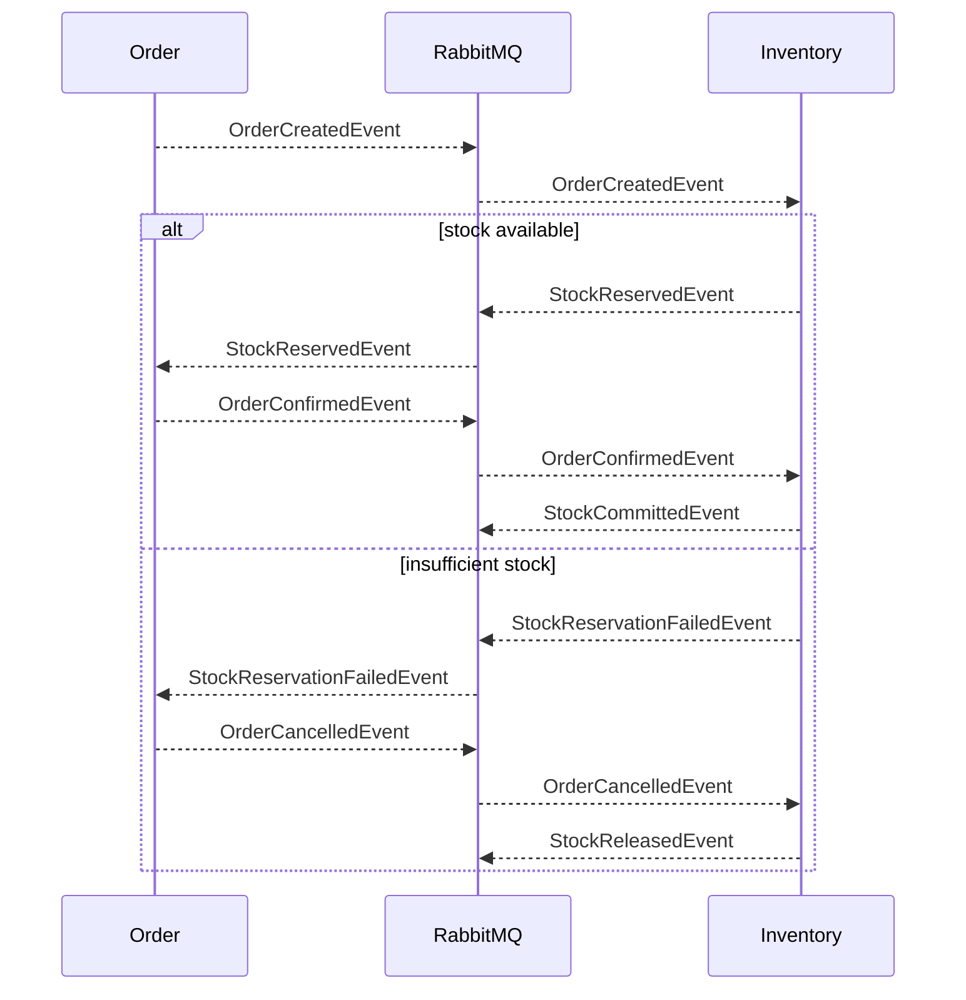

# Integration Events Catalog

All cross-service communication happens through events published to a single RabbitMQ fanout exchange (`ecommerce-exchange`). Each subscribing service binds its own queue, so every subscriber receives every event and can filter by type.

## Event ⇄ service matrix

| Event | Publisher | Subscribers |
|---|---|---|
| `ProductCreatedEvent` | [Product](Service-Product) | [Inventory](Service-Inventory) |
| `ProductPriceUpdatedEvent` | Product | [Basket](Service-Basket) |
| `OrderCreatedEvent` | [Order](Service-Order) | [Basket](Service-Basket), [Inventory](Service-Inventory) |
| `OrderConfirmedEvent` | Order | Inventory |
| `OrderCancelledEvent` | Order | Inventory |
| `StockReservedEvent` | Inventory | Order |
| `StockReservationFailedEvent` | Inventory | Order |
| `StockCommittedEvent` | Inventory | — (ops/audit) |
| `StockReleasedEvent` | Inventory | — (ops/audit) |
| `StockAdjustedEvent` | Inventory | — (ops/audit) |
| `StockDepletedEvent` | Inventory | — (ops/audit) |
| `LowStockEvent` | Inventory | — (ops/audit) |

## Saga sequence

## Payload conventions

All events derive from the shared `Event` base class (see [Shared-Library](Shared-Library)) which carries:

- `Id` — a unique identifier used for idempotency on the subscriber side
- `OccurredAt` — UTC timestamp

Concrete payloads (product id, order id, quantities, prices) live alongside the event type in each service's `IntegrationEvents/` folder — that folder is the authoritative schema. Link targets per event:

- Product events: [`product-microservice/Product.Service/IntegrationEvents/`](https://github.com/daonhan/Microservices-in-.NET/tree/main/product-microservice/Product.Service/IntegrationEvents)
- Order events: [`order-microservice/Order.Service/IntegrationEvents/`](https://github.com/daonhan/Microservices-in-.NET/tree/main/order-microservice/Order.Service/IntegrationEvents)
- Inventory events: [`inventory-microservice/Inventory.Service/IntegrationEvents/`](https://github.com/daonhan/Microservices-in-.NET/tree/main/inventory-microservice/Inventory.Service/IntegrationEvents)

## Delivery semantics

- **At-least-once publish** via the [Transactional Outbox](Shared-Library#transactional-outbox--why-it-matters).
- **Idempotent handlers** — subscribers use `Event.Id` (or the business key) to deduplicate.
- **Span context propagation** — traces carry across the bus via the shared observability layer, so a single Jaeger trace spans the full saga.
