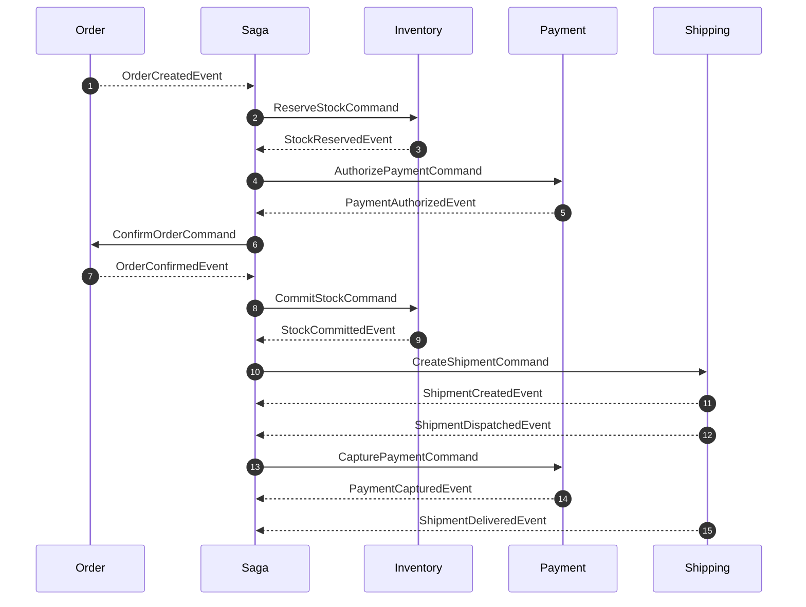

# Integration Events Catalog

All cross-service communication happens through messages published to a single broker exchange (RabbitMQ fanout `ecommerce-exchange` by default, Azure Service Bus topic when `Messaging:Provider=AzureServiceBus`). Each subscribing service binds its own queue and filters by message type. The order saga is coordinated by the [Saga service](Service-Saga): Order, Inventory, Payment, and Shipping no longer cross-subscribe to one another for saga steps — they consume commands from Saga and publish reply events back.

## Event ⇄ service matrix

| Event | Publisher | Subscribers |
|---|---|---|
| `ProductCreatedEvent` | [Product](Service-Product) | [Inventory](Service-Inventory), [Order](Service-Order) (price cache) |
| `ProductPriceUpdatedEvent` | Product | [Basket](Service-Basket) |
| `OrderCreatedEvent` | [Order](Service-Order) | [Basket](Service-Basket), [Saga](Service-Saga) |
| `OrderConfirmedEvent` | Order | [Saga](Service-Saga) |
| `OrderCancelledEvent` | Order | [Saga](Service-Saga) |
| `StockReservedEvent` | [Inventory](Service-Inventory) | [Saga](Service-Saga) |
| `StockReservationFailedEvent` | Inventory | [Saga](Service-Saga) |
| `StockCommittedEvent` | Inventory | [Saga](Service-Saga) |
| `StockReleasedEvent` | Inventory | [Saga](Service-Saga) |
| `StockAdjustedEvent` | Inventory | — (ops/audit) |
| `StockDepletedEvent` | Inventory | — (ops/audit) |
| `LowStockEvent` | Inventory | — (ops/audit) |
| `ShipmentCreatedEvent` | [Shipping](Service-Shipping) | [Saga](Service-Saga) |
| `ShipmentDispatchedEvent` | Shipping | [Saga](Service-Saga) |
| `ShipmentDeliveredEvent` | Shipping | [Saga](Service-Saga) |
| `ShipmentCancelledEvent` | Shipping | [Saga](Service-Saga) |
| `ShipmentFailedEvent` | Shipping | [Saga](Service-Saga) |
| `ShipmentReturnedEvent` | Shipping | — (ops/audit) |
| `ShipmentStatusChangedEvent` | Shipping | — (ops/audit) |
| `PaymentAuthorizedEvent` | [Payment](Service-Payment) | [Saga](Service-Saga) |
| `PaymentFailedEvent` | Payment | [Saga](Service-Saga) |
| `PaymentCapturedEvent` | Payment | [Saga](Service-Saga) |
| `PaymentVoidedEvent` | Payment | [Saga](Service-Saga) |
| `PaymentRefundedEvent` | Payment | [Saga](Service-Saga) |

## Saga command catalog

Saga drives participants exclusively via commands. Every command inherits from `Command`, carries `SagaId` and `CausationId`, and flows through the same broker + outbox + DLQ path as integration events.

| Command | Sender → Receiver | Expected reply events |
|---|---|---|
| `ReserveStockCommand` | Saga → [Inventory](Service-Inventory) | `StockReservedEvent`, `StockReservationFailedEvent` |
| `CommitStockCommand` | Saga → Inventory | `StockCommittedEvent` |
| `ReleaseStockCommand` | Saga → Inventory | `StockReleasedEvent` |
| `AuthorizePaymentCommand` | Saga → [Payment](Service-Payment) | `PaymentAuthorizedEvent`, `PaymentFailedEvent` |
| `CapturePaymentCommand` | Saga → Payment | `PaymentCapturedEvent`, `PaymentFailedEvent` |
| `VoidPaymentCommand` | Saga → Payment | `PaymentVoidedEvent`, `PaymentFailedEvent` |
| `RefundPaymentCommand` | Saga → Payment | `PaymentRefundedEvent`, `PaymentFailedEvent` |
| `ConfirmOrderCommand` | Saga → [Order](Service-Order) | `OrderConfirmedEvent` |
| `CancelOrderCommand` | Saga → Order | `OrderCancelledEvent` |
| `CreateShipmentCommand` | Saga → [Shipping](Service-Shipping) | `ShipmentCreatedEvent`, `ShipmentFailedEvent` |
| `CancelShipmentCommand` | Saga → Shipping | `ShipmentCancelledEvent`, `ShipmentFailedEvent` |

## Saga and fulfillment sequence

```mermaid
sequenceDiagram
    autonumber
    participant O as Order
    participant Sg as Saga
    participant I as Inventory
    participant P as Payment
    participant Sh as Shipping
    O-->>Sg: OrderCreatedEvent
    Sg->>I: ReserveStockCommand
    I-->>Sg: StockReservedEvent
    Sg->>P: AuthorizePaymentCommand
    P-->>Sg: PaymentAuthorizedEvent
    Sg->>O: ConfirmOrderCommand
    O-->>Sg: OrderConfirmedEvent
    Sg->>I: CommitStockCommand
    I-->>Sg: StockCommittedEvent
    Sg->>Sh: CreateShipmentCommand
    Sh-->>Sg: ShipmentCreatedEvent
    Sh-->>Sg: ShipmentDispatchedEvent
    Sg->>P: CapturePaymentCommand
    P-->>Sg: PaymentCapturedEvent
    Sh-->>Sg: ShipmentDeliveredEvent
```

Compensation flow (orchestrator-issued reverse commands) is documented in [Diagram-Saga](Diagram-Saga#compensation-orchestrator-issued-reverse-commands).

## Payload conventions

All events derive from the shared `Event` base class (see [Shared-Library](Shared-Library)) which carries:

- `Id` — a unique identifier used for idempotency on the subscriber side
- `OccurredAt` — UTC timestamp

Concrete payloads (product id, order id, quantities, prices, shipment id, carrier info, etc.) live alongside the event type in each service's `IntegrationEvents/` folder — that folder is the authoritative schema. Link targets per event:

- Product events: [`product-microservice/Product.Service/IntegrationEvents/`](https://github.com/daonhan/Microservices-in-.NET/tree/main/product-microservice/Product.Service/IntegrationEvents)
- Order events: [`order-microservice/Order.Service/IntegrationEvents/`](https://github.com/daonhan/Microservices-in-.NET/tree/main/order-microservice/Order.Service/IntegrationEvents)
- Inventory events: [`inventory-microservice/Inventory.Service/IntegrationEvents/`](https://github.com/daonhan/Microservices-in-.NET/tree/main/inventory-microservice/Inventory.Service/IntegrationEvents)
- Shipping events: [`shipping-microservice/Shipping.Service/IntegrationEvents/`](https://github.com/daonhan/Microservices-in-.NET/tree/main/shipping-microservice/Shipping.Service/IntegrationEvents)
- Payment events: [`payment-microservice/Payment.Service/IntegrationEvents/`](https://github.com/daonhan/Microservices-in-.NET/tree/main/payment-microservice/Payment.Service/IntegrationEvents)

## Delivery semantics

- **At-least-once publish** via the [Transactional Outbox](Shared-Library#transactional-outbox--why-it-matters).
- **Idempotent handlers** — subscribers use `Event.Id` (or the business key) to deduplicate.
- **Span context propagation** — traces carry across the bus via the shared observability layer, so a single Jaeger trace spans the full saga.
