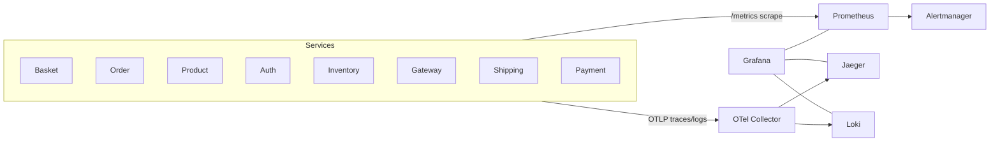

# Observability

Every service emits **traces**, **metrics**, and **logs** via OpenTelemetry. Everything funnels through the OTel Collector and is visible in Grafana.

## Pipeline

## UIs and ports

| UI | URL | Purpose |
|---|---|---|
| Jaeger | http://localhost:16686 | Search and visualize distributed traces |
| Prometheus | http://localhost:9090 | Raw metric queries, alert state |
| Alertmanager | http://localhost:9093 | Firing alerts, silences, routing |
| Grafana | http://localhost:3000 | Dashboards across metrics, logs, traces |
| Loki | http://localhost:3100 | Log store (queried via Grafana) |

Config lives under [`observability/`](https://github.com/daonhan/Microservices-in-.NET/tree/main/observability):
- `otel-collector-config.yaml`
- `prometheus-config.yaml`
- `alertmanager.yaml`
- `alerts.yaml`
- `grafana/` — provisioned dashboards and datasources
- `loki/`

## Exporters

Docker Compose runs Prometheus exporters for third-party infra:
- **RabbitMQ exporter** on :9419
- **Redis exporter** on :9121
- **MSSQL exporter** on :4000

## Alerts

From [`observability/alerts.yaml`](https://github.com/daonhan/Microservices-in-.NET/blob/main/observability/alerts.yaml):

| Alert | Condition | Severity |
|---|---|---|
| `HighHttpErrorRate` | >5% HTTP 5xx for 5m | warning |
| `HighHttpLatencyP95` | p95 HTTP latency >1s for 5m | warning |
| `RabbitMqQueueBacklog` | queue depth >1000 ready messages | warning |
| `ServiceDown` | Prometheus scrape failing for 2m | critical |
| `LowStockAlert` | stock reservation failures observed | warning |

## Custom metrics

Services register counters/histograms via `MetricFactory` from [Shared-Library](Shared-Library). Metric names follow `service_domain_measurement` (e.g. `order_created_total`).

### Shipping metrics

- `shipments_total{status}` — counter, incremented on every transition
- `time_to_dispatch_seconds` — histogram, time from creation to dispatch
- `time_to_delivery_seconds` — histogram, time from creation to delivered
- `rate_shopping_quote_spread` — histogram, price spread on quote

### Payment metrics

- `payments_total{status}` — counter, incremented on payment status transitions
- `payment_authorize_latency_ms` — histogram, time spent authorizing through the configured payment gateway

## Tracing across the bus

`RabbitMqEventBus` injects W3C Trace Context into each message's headers, and the subscriber extracts it before invoking the handler. A single Jaeger trace therefore spans the Order `POST /order/{customerId}` request all the way through the Inventory reservation handler and back.

## Related PRD and plan

- [`docs/prd/PRD-Observability.md`](https://github.com/daonhan/Microservices-in-.NET/blob/main/docs/prd/PRD-Observability.md)
- [`docs/plans/observability-polish.md`](https://github.com/daonhan/Microservices-in-.NET/blob/main/docs/plans/observability-polish.md)
