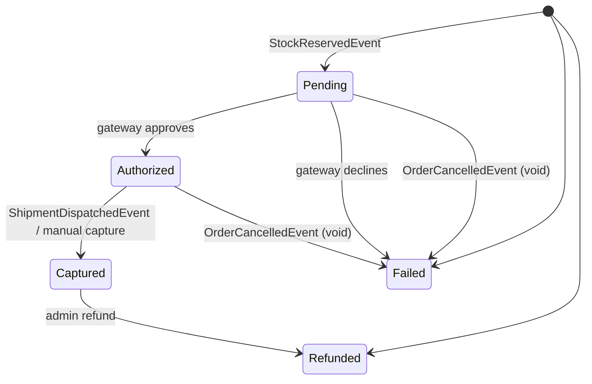
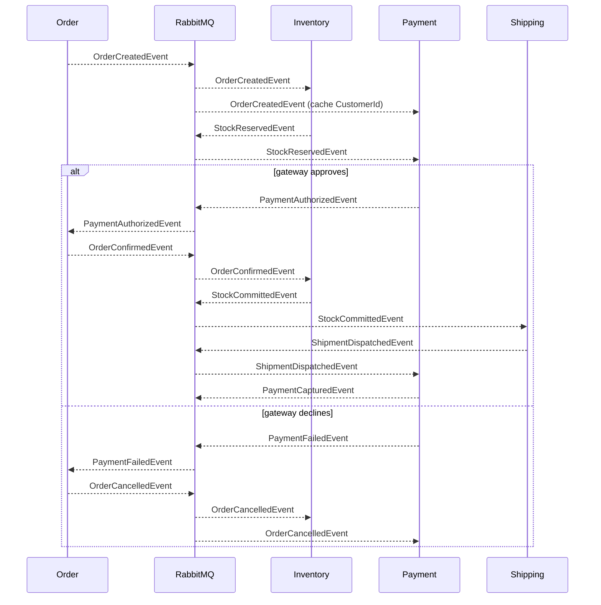

# Payment Service

Closes the checkout loop with authorize/capture/refund against a pluggable provider. Joins the existing Order ↔ Inventory ↔ Shipping choreography as a sibling participant: authorizes on `StockReservedEvent`, captures on `ShipmentDispatchedEvent`, and compensates on `OrderCancelledEvent`. Defaults to a deterministic in-memory gateway so the saga runs end-to-end with no external PSP secrets.

| | |
|---|---|
| **Port** | 8007 (host) → 8080 (container) |
| **Datastore** | SQL Server (database: `Payment`) |
| **Source** | [`payment-microservice/Payment.Service/`](https://github.com/daonhan/Microservices-in-.NET/tree/main/payment-microservice/Payment.Service) |
| **Tests** | [`payment-microservice/Payment.Tests/`](https://github.com/daonhan/Microservices-in-.NET/tree/main/payment-microservice/Payment.Tests) |
| **Publishes** | `PaymentAuthorizedEvent`, `PaymentFailedEvent`, `PaymentCapturedEvent`, `PaymentRefundedEvent` |
| **Subscribes** | `OrderCreatedEvent`, `StockReservedEvent`, `ShipmentDispatchedEvent`, `OrderCancelledEvent` |

## Responsibilities

- Authorize the order amount on `StockReservedEvent` against `IPaymentGateway`; emit `PaymentAuthorizedEvent` on success or `PaymentFailedEvent` on decline.
- Capture authorized funds when goods leave the warehouse (`ShipmentDispatchedEvent`); emit `PaymentCapturedEvent`.
- Compensate on `OrderCancelledEvent`: void/refund any in-flight `Pending` or `Authorized` payment for the cancelled order. Idempotent.
- Expose ownership-checked read endpoints to customers and admin-only refund/manual-capture endpoints.
- Cache `(OrderId, CustomerId)` from `OrderCreatedEvent` so authorize knows the owning customer without an extra round trip.
- Emit metrics for payment volume per status and authorize latency.

## HTTP endpoints

All endpoints sit behind the gateway under `/payment` and require a valid JWT.

| Method | Route | Auth | Purpose |
|---|---|---|---|
| `GET` | `/payment/by-order/{orderId}` | Customer/Admin | Get the payment for an order (404 if not owner/admin) |
| `GET` | `/payment/{paymentId}` | Customer/Admin | Get a payment by id (404 if not owner/admin) |
| `POST` | `/payment/{paymentId}/capture` | Admin | Manual capture override (`Authorized → Captured`); idempotent |
| `POST` | `/payment/{paymentId}/refund` | Admin | Refund a captured payment (`Captured → Refunded`); body `{ amount?: decimal }` defaults to full |

Implementation: `Endpoints/PaymentApiEndpoints.cs`. Cross-customer reads return 404 (not 403), matching the Shipping pattern.

## State machine



Transitions are exposed on the `Payment` aggregate (`Authorize`, `Fail`, `Capture`, `Refund`, `Void`); illegal transitions throw `InvalidOperationException`. Unique constraint on `OrderId` enforces idempotency on redelivered `StockReservedEvent`.

## Saga participation

Payment moves the saga's "confirm" edge: Order no longer confirms on `StockReservedEvent` directly; it confirms in response to `PaymentAuthorizedEvent`. On decline, Order publishes the existing `OrderCancelledEvent` so Inventory's existing handler releases the reservation — no parallel compensation channel is introduced.



## Payment gateway abstraction

- `IPaymentGateway` — `AuthorizeAsync(amount, currency, reference)`, `CaptureAsync(reference)`, `RefundAsync(reference, amount)`.
- `InMemoryPaymentGateway` — deterministic by amount cents (`.00` approves, `.99` declines). Lets the saga run end-to-end in CI without a real PSP.
- A real Stripe/Adyen implementation can be slotted behind config without changing consumers.

## Integration events

- **Publishes**:
  - `PaymentAuthorizedEvent` — `{ PaymentId, OrderId, CustomerId, Amount, Currency }`
  - `PaymentFailedEvent` — `{ PaymentId, OrderId, CustomerId, Reason }`
  - `PaymentCapturedEvent` — `{ PaymentId, OrderId, Amount }`
  - `PaymentRefundedEvent` — `{ PaymentId, OrderId, Amount }`
- **Subscribes**:
  - `OrderCreatedEvent` — caches `(OrderId, CustomerId)` so authorize knows ownership.
  - `StockReservedEvent` — creates `Pending` row, calls gateway, transitions to `Authorized` or `Failed`.
  - `ShipmentDispatchedEvent` — captures the authorized payment.
  - `OrderCancelledEvent` — voids in-flight `Pending`/`Authorized` payments for the cancelled order; idempotent on terminal states.

All published events go through the shared transactional outbox, so payment events cannot be lost mid-write.

## Metrics

- `payments_total{status}` — counter, incremented on every transition (Pending/Authorized/Failed/Captured/Refunded).
- `payment_authorize_latency_ms` — histogram, measured around the `IPaymentGateway.AuthorizeAsync` call.

## Migrations

- `20260425120000_InitialCreate` — `Payment` table, unique index on `OrderId`.
- `20260426000000_AddOrderCustomer` — `(OrderId, CustomerId)` cache populated from `OrderCreatedEvent`.

## Structure

```
Payment.Service/
├── Program.cs
├── Endpoints/PaymentApiEndpoints.cs
├── Models/                         # Payment aggregate, PaymentStatus, OrderCustomer
├── Infrastructure/
│   ├── Data/                       # IPaymentStore, EF Core context, configurations, seed
│   └── Gateways/                   # IPaymentGateway, InMemoryPaymentGateway
├── IntegrationEvents/              # published + subscribed events and handlers
├── Observability/PaymentMetrics.cs
└── Migrations/
```

## Related PRD and plan

- [`docs/prd/PRD-Payment.md`](https://github.com/daonhan/Microservices-in-.NET/blob/main/docs/prd/PRD-Payment.md)
- [`docs/plans/payment-service.md`](https://github.com/daonhan/Microservices-in-.NET/blob/main/docs/plans/payment-service.md)
