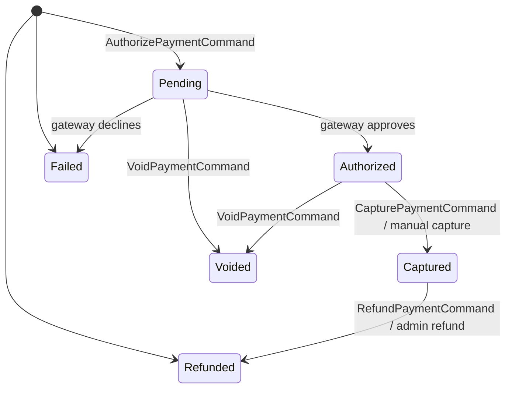

# Payment Service

Closes the checkout loop with authorize/capture/refund against a pluggable provider. Joins the order saga as an orchestrated participant: authorizes on `AuthorizePaymentCommand`, captures on `CapturePaymentCommand`, voids on `VoidPaymentCommand`, and refunds on `RefundPaymentCommand`. Defaults to a deterministic in-memory gateway so the saga runs end-to-end with no external PSP secrets.

| | |
|---|---|
| **Port** | 8007 (host) → 8080 (container) |
| **Datastore** | SQL Server (database: `Payment`) |
| **Source** | [`payment-microservice/Payment.Service/`](https://github.com/daonhan/Microservices-in-.NET/tree/main/payment-microservice/Payment.Service) |
| **Tests** | [`payment-microservice/Payment.Tests/`](https://github.com/daonhan/Microservices-in-.NET/tree/main/payment-microservice/Payment.Tests) |
| **Publishes** | `PaymentAuthorizedEvent`, `PaymentFailedEvent`, `PaymentCapturedEvent`, `PaymentVoidedEvent`, `PaymentRefundedEvent` |
| **Subscribes** | `AuthorizePaymentCommand`, `CapturePaymentCommand`, `VoidPaymentCommand`, `RefundPaymentCommand` (from Saga); `OrderCreatedEvent` (customer cache) |
| **Layout** | Clean Architecture + Vertical Slices default ([ADR-0012](https://github.com/daonhan/Microservices-in-.NET/blob/main/docs/adr/0012-clean-arch-vsa-default-service-shape.md)); Payment re-adopts the outbox seam for multi-producer domain events. |

## Responsibilities

- Cache `(OrderId, CustomerId)` from `OrderCreatedEvent` so authorize knows the owning customer without an extra round trip.
- Execute `AuthorizePaymentCommand` against `IPaymentGateway`; publish `PaymentAuthorizedEvent` on success or `PaymentFailedEvent` on decline as the reply event.
- Execute `CapturePaymentCommand` when Saga advances after shipment dispatch; publish `PaymentCapturedEvent`.
- Execute `VoidPaymentCommand` / `RefundPaymentCommand` during compensation; publish `PaymentVoidedEvent` / `PaymentRefundedEvent`. Both are idempotent on terminal states.
- Expose ownership-checked read endpoints to customers and admin-only refund/manual-capture endpoints.
- Emit metrics for payment volume per status and authorize latency.

## HTTP endpoints

All endpoints sit behind the gateway under `/payment` and require a valid JWT.

| Method | Route | Auth | Purpose |
|---|---|---|---|
| `GET` | `/payment/by-order/{orderId}` | Customer/Admin | Get the payment for an order (404 if not owner/admin) |
| `GET` | `/payment/{paymentId}` | Customer/Admin | Get a payment by id (404 if not owner/admin) |
| `POST` | `/payment/{paymentId}/capture` | Admin | Manual capture override (`Authorized → Captured`); idempotent |
| `POST` | `/payment/{paymentId}/refund` | Admin | Refund a captured payment (`Captured → Refunded`); body `{ amount?: decimal }` defaults to full |

Implementations live under `Features/`, including `GetPaymentByOrder/`, `GetPaymentById/`, `CapturePayment/`, `RefundPayment/`, saga command slices, and `OrderCreated/`. Cross-customer reads return 404 (not 403), matching the Shipping pattern.

## State machine


```mermaid
stateDiagram-v2
    [*] --> Pending: AuthorizePaymentCommand
    Pending --> Authorized: gateway approves
    Pending --> Failed: gateway declines
    Authorized --> Captured: CapturePaymentCommand / manual capture
    Captured --> Refunded: RefundPaymentCommand / admin refund
    Authorized --> Voided: VoidPaymentCommand
    Pending --> Voided: VoidPaymentCommand
    [*] --> Failed
    [*] --> Refunded
```

Transitions are exposed on the `Payment` aggregate (`Authorize`, `Fail`, `Capture`, `Refund`, `Void`); illegal transitions throw `InvalidOperationException`. Unique constraint on `OrderId` enforces idempotency on redelivered `AuthorizePaymentCommand`.

## Saga participation

Payment is an orchestrated participant. The [Saga service](Service-Saga) gates the order's "confirm" edge on `PaymentAuthorizedEvent` and never advances unpaid orders to shipment. Compensation is explicit: Saga issues `VoidPaymentCommand` if only authorized, `RefundPaymentCommand` if already captured. See the canonical sequence in [Diagram-Saga](Diagram-Saga).

## Payment gateway abstraction

- `IPaymentGateway` — `AuthorizeAsync(amount, currency, reference)`, `CaptureAsync(reference)`, `RefundAsync(reference, amount)`.
- `InMemoryPaymentGateway` — deterministic by amount cents (`.00` approves, `.99` declines). Lets the saga run end-to-end in CI without a real PSP.
- A real Stripe/Adyen implementation can be slotted behind config without changing consumers.

## Integration events and commands

- **Publishes (reply events)**:
  - `PaymentAuthorizedEvent` — `{ PaymentId, OrderId, CustomerId, Amount, Currency }`
  - `PaymentFailedEvent` — `{ PaymentId, OrderId, CustomerId, Reason }`
  - `PaymentCapturedEvent` — `{ PaymentId, OrderId, Amount }`
  - `PaymentVoidedEvent` — `{ PaymentId, OrderId }`
  - `PaymentRefundedEvent` — `{ PaymentId, OrderId, Amount }`
- **Subscribes (saga commands)**:
  - `AuthorizePaymentCommand` — creates `Pending` row, calls gateway, transitions to `Authorized` or `Failed`. Publishes the matching reply event.
  - `CapturePaymentCommand` — captures the authorized payment; publishes `PaymentCapturedEvent`.
  - `VoidPaymentCommand` — voids in-flight `Pending`/`Authorized` payments; idempotent on terminal states.
  - `RefundPaymentCommand` — refunds a captured payment (full or partial); publishes `PaymentRefundedEvent`.
- **Subscribes (events)**:
  - `OrderCreatedEvent` — caches `(OrderId, CustomerId)` so the authorize handler knows ownership without an extra round trip.

All published events and incoming commands flow through the shared transactional outbox + broker path, so payment state and reply events cannot diverge.

## Metrics

- `payments_total{status}` — counter, incremented on every transition (Pending/Authorized/Failed/Captured/Refunded).
- `payment_authorize_latency_ms` — histogram, measured around the `IPaymentGateway.AuthorizeAsync` call.

## Migrations

- `20260425120000_InitialCreate` — `Payment` table, unique index on `OrderId`.
- `20260426000000_AddOrderCustomer` — `(OrderId, CustomerId)` cache populated from `OrderCreatedEvent`.

## Structure

```
Payment.Service/
├── Program.cs
├── Dockerfile                  # Multi-stage build
├── Features/                       # HTTP, command, event, and integration-map slices
├── Domain/                         # Payment aggregate, PaymentStatus, OrderCustomer
├── Contracts/Integration/          # published + subscribed event contracts
├── Infrastructure/
│   ├── Data/                       # IPaymentStore, EF Core context, configurations, seed
│   ├── Gateways/                   # IPaymentGateway, InMemoryPaymentGateway
│   └── Observability/              # PaymentMetrics
└── Migrations/
```

## Related PRD and plan

- [`docs/prd/PRD-Payment.md`](https://github.com/daonhan/Microservices-in-.NET/blob/main/docs/prd/PRD-Payment.md)
- [`docs/plans/payment-service.md`](https://github.com/daonhan/Microservices-in-.NET/blob/main/docs/plans/payment-service.md)
