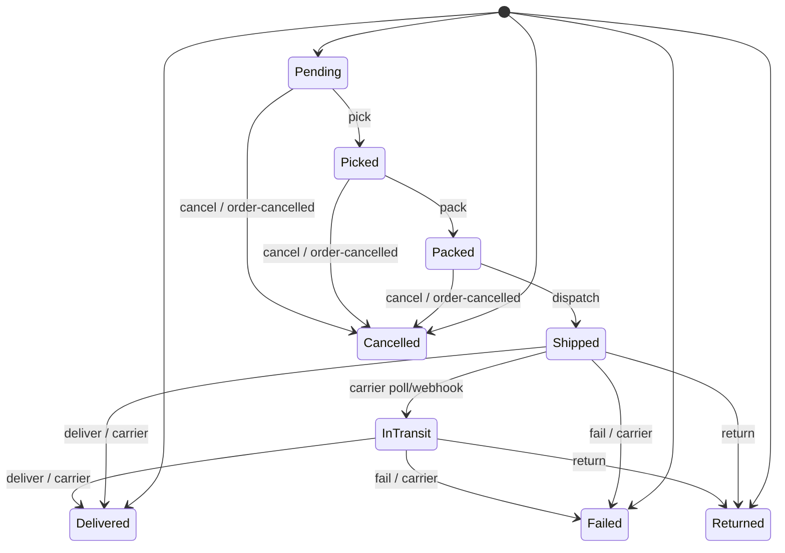

# Shipping Service

Handles shipment lifecycle, carrier integration, and event-driven fulfillment for orders. Implements a rich state machine, admin/customer flows, and emits milestone events for observability and downstream processing.

| | |
|---|---|
| **Port** | (dynamic; see deployment) |
| **Datastore** | SQL Server (database: `Shipping`) |
| **Source** | [`shipping-microservice/Shipping.Service/`](https://github.com/daonhan/Microservices-in-.NET/tree/main/shipping-microservice/Shipping.Service) |
| **Tests** | [`shipping-microservice/Shipping.Tests/`](https://github.com/daonhan/Microservices-in-.NET/tree/main/shipping-microservice/Shipping.Tests) |
| **Publishes** | `ShipmentCreatedEvent`, `ShipmentDispatchedEvent`, `ShipmentDeliveredEvent`, `ShipmentCancelledEvent`, `ShipmentFailedEvent`, `ShipmentReturnedEvent`, `ShipmentStatusChangedEvent` |
| **Subscribes** | `StockCommittedEvent`, `OrderCancelledEvent` |

## Responsibilities

- Create shipments for orders (on `StockCommittedEvent`)
- Track shipment state: Pending → Picked → Packed → Shipped → InTransit → Delivered/Cancelled/Failed/Returned
- Integrate with carriers (rate shopping, dispatch, status polling, webhooks)
- Enforce customer/admin access and transitions
- Emit milestone and status-changed events for each transition
- Record shipment status history (with source and reason)
- Expose metrics for shipment lifecycle and carrier performance

## HTTP endpoints

| Method | Route | Auth | Purpose |
|---|---|---|---|
| `GET` | `/shipping/by-order/{orderId}` | Customer/Admin | List shipments for an order (403 if not owner/admin) |
| `GET` | `/shipping/{shipmentId}` | Customer/Admin | Get a shipment (403 if not owner/admin) |
| `GET` | `/shipping` | Admin | List shipments (filter by status, warehouse, date, paginated) |
| `POST` | `/shipping/{id}/pick` | Admin | Mark as picked |
| `POST` | `/shipping/{id}/pack` | Admin | Mark as packed |
| `POST` | `/shipping/{id}/cancel` | Admin | Cancel (with reason) |
| `POST` | `/shipping/{id}/deliver` | Admin | Mark as delivered |
| `POST` | `/shipping/{id}/fail` | Admin | Mark as failed (with reason) |
| `POST` | `/shipping/{id}/return` | Admin | Mark as returned (with reason) |
| `GET` | `/shipping/{id}/quotes` | Admin | Get ranked carrier quotes |
| `POST` | `/shipping/{id}/dispatch` | Admin | Dispatch via carrier (stores carrier/tracking/label/price/address) |
| `POST` | `/shipping/webhooks/carrier/{carrierKey}` | None (shared secret) | Carrier webhook for status updates |

## State machine



## Integration events

- **Publishes**:
  - `ShipmentCreatedEvent` (on creation)
  - `ShipmentDispatchedEvent` (on dispatch)
  - `ShipmentDeliveredEvent` (on delivered)
  - `ShipmentCancelledEvent` (on cancel)
  - `ShipmentFailedEvent` (on fail)
  - `ShipmentReturnedEvent` (on return)
  - `ShipmentStatusChangedEvent` (on every transition)
- **Subscribes**:
  - `StockCommittedEvent` (creates shipment)
  - `OrderCancelledEvent` (cancels shipment if not terminal)

## Carrier integration

- **ICarrierGateway** abstraction for quoting, dispatch, and status
- Two fake carriers (Express, Ground) for demo/testing
- Rate shopping service ranks by price, then speed
- Carrier polling service (background) and webhook endpoint for status updates

## Metrics

- `shipments_total{status}` — counter, incremented on every transition
- `time_to_dispatch_seconds` — histogram, time from creation to dispatch
- `time_to_delivery_seconds` — histogram, time from creation to delivered
- `rate_shopping_quote_spread` — histogram, price spread on quote

## Migrations

- `20260424015621_InitialCreate`
- `20260425000000_AddShipmentStatusHistory`
- `20260425100000_AddShipmentCarrierFields`

## Structure

```
Shipping.Service/
├── Program.cs
├── Endpoints/ShippingApiEndpoints.cs
├── ApiModels/
├── Models/                 # Shipment aggregate, status history
├── Carriers/               # ICarrierGateway, fakes, polling, webhook parser
├── IntegrationEvents/      # published + subscribed events
├── Infrastructure/Data/    # EF Core context
└── Migrations/
```

## Related PRD and plan

- [`docs/prd/PRD-Shipping.md`](https://github.com/daonhan/Microservices-in-.NET/blob/main/docs/prd/PRD-Shipping.md)
- [`docs/plans/shipping-service.md`](https://github.com/daonhan/Microservices-in-.NET/blob/main/docs/plans/shipping-service.md)
