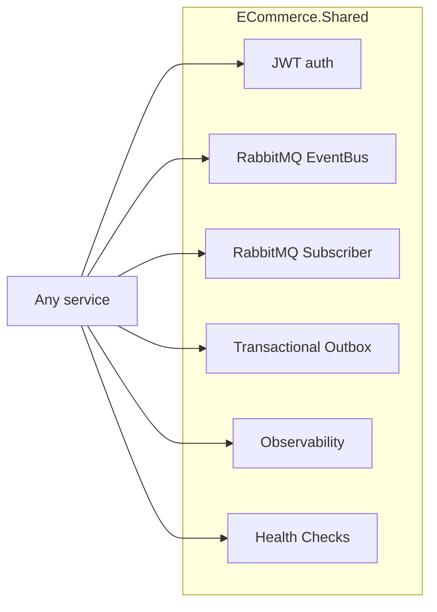

# Shared Library — `ECommerce.Shared`

A single internal NuGet package under [`shared-libs/ECommerce.Shared`](https://github.com/daonhan/Microservices-in-.NET/tree/main/shared-libs/ECommerce.Shared) provides the cross-cutting infrastructure every service needs. It is published to a local NuGet feed under [`local-nuget-packages/`](https://github.com/daonhan/Microservices-in-.NET/tree/main/local-nuget-packages) so services can version-pin it like any other dependency.

## What's inside



## Public DI surface

| Extension | Purpose |
|---|---|
| `AddJwtAuthentication(IConfiguration)` | Configures JWT Bearer with HS256 and the standard claim map |
| `UseJwtAuthentication()` | Middleware pair (`UseAuthentication()` + `UseAuthorization()`) |
| `AddRabbitMqEventBus()` | Connection + channel management |
| `AddRabbitMqEventPublisher()` | Registers `IEventBus` for publishing |
| `AddRabbitMqSubscriberService()` | Hosts `RabbitMqHostedService` to consume events |
| `AddEventHandler<TEvent, THandler>()` | Keyed DI so one service can register many handlers |
| `AddOutbox<TContext>()` | Outbox table, `OutboxBackgroundService`, and write helpers |
| `AddPlatformObservability()` | OTLP traces + Prometheus metrics + OTLP logs |
| `AddPlatformHealthChecks()` + `MapPlatformHealthChecks()` | `/health/live`, `/health/ready` |
| `AddSqlServerProbe()`, `AddRedisProbe()`, `AddRabbitMqProbe()` | Per-dependency readiness probes |

## Key abstractions

| Type | Role |
|---|---|
| `Event` | Base class for all integration events (carries `Id`, `OccurredAt`) |
| `IEventBus` | Publish an `Event` to the fanout exchange |
| `IEventHandler<TEvent>` | Subscriber contract; implementations are keyed-DI-registered |
| `IRabbitMqConnection` | Shared connection with Polly retry |
| `IOutboxStore` | Atomic "persist + enqueue event" primitive |
| `MetricFactory` | Cached creation of Counters and Histograms |

## Transactional Outbox — why it matters

Without the outbox, a service that writes its domain row and publishes its event separately risks two failure modes:

1. DB commits, broker publish fails → downstream never sees the change.
2. Broker publish succeeds, DB rolls back → phantom event.

With the outbox, the business row and the outbox row are written in the **same** transaction. A background service periodically polls the outbox and publishes. At-least-once delivery + idempotent handlers = exactly-once effect.

## Observability wiring

`AddPlatformObservability()` wires:

- **Traces**: ASP.NET Core, HttpClient, EF Core, RabbitMQ span context propagation → OTLP → Jaeger
- **Metrics**: Runtime, ASP.NET Core, custom via `MetricFactory` → scraped on `/metrics` by Prometheus
- **Logs**: Structured logs → OTLP → Loki

See [Observability](Observability) for the full pipeline.

## Building the library

```bash
cd shared-libs/ECommerce.Shared
dotnet pack -c Release
dotnet nuget push bin/Release/*.nupkg -s ../local-nuget-packages
```

Services consume it via `nuget.config` in each microservice folder, pointing at `../local-nuget-packages`.
