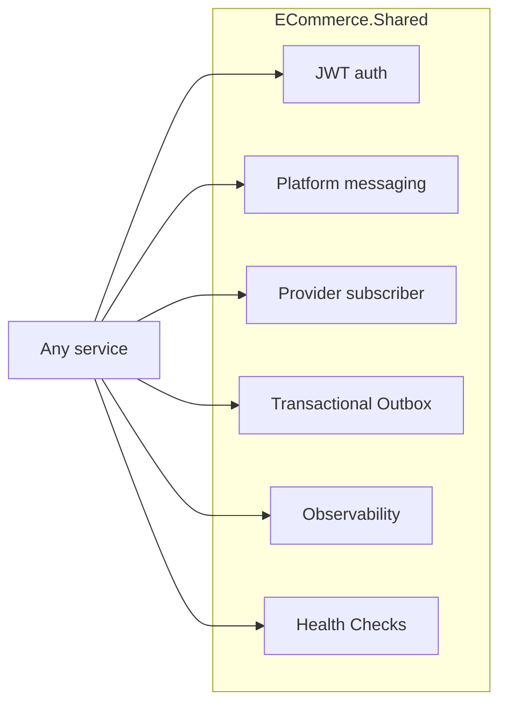

# Shared Library — `ECommerce.Shared`

A single internal NuGet package under [`shared-libs/ECommerce.Shared`](https://github.com/daonhan/Microservices-in-.NET/tree/main/shared-libs/ECommerce.Shared) provides the cross-cutting infrastructure every service needs. It is published to a local NuGet feed under [`local-nuget-packages/`](https://github.com/daonhan/Microservices-in-.NET/tree/main/local-nuget-packages) so services can version-pin it like any other dependency.

## What's inside


```mermaid
graph LR
    subgraph ECommerce.Shared
        Jwt[JWT auth]
        Bus[Platform messaging]
        Sub[Provider subscriber]
        Outbox[Transactional Outbox]
        Obs[Observability]
        Health[Health Checks]
    end
    Svc[Any service] --> Jwt
    Svc --> Bus
    Svc --> Sub
    Svc --> Outbox
    Svc --> Obs
    Svc --> Health
```

## Public DI surface

| Extension | Purpose |
|---|---|
| `AddJwtAuthentication(IConfiguration)` | Configures JWT Bearer (HS256 user tokens + RS256 service tokens via JWKS) and the standard claim map |
| `UseJwtAuthentication()` | Middleware pair (`UseAuthentication()` + `UseAuthorization()`) |
| `AddRequireOperatorPolicy()` / `AddRequireServicePolicy()` | Register the `RequireOperator` and `RequireService` authorization policies (see [Authorization policies](#authorization-policies)) |
| `AddPlatformEventBus(IConfiguration)` | Registers the configured messaging provider; `Messaging:Provider` defaults to `RabbitMq` and can be set to `AzureServiceBus` |
| `AddPlatformEventPublisher(IConfiguration)` | Registers `IEventBus` for publishing through the selected provider |
| `AddPlatformSubscriberService(IConfiguration)` | Hosts the selected provider's subscriber service |
| `AddEventHandler<TEvent, THandler>()` | Keyed DI so one service can register many handlers |
| `AddOutbox<TContext>()` | Outbox table, `OutboxBackgroundService`, and write helpers |
| `AddPlatformObservability()` | OTLP traces + Prometheus metrics + OTLP logs |
| `AddPlatformHealthChecks()` + `MapPlatformHealthChecks()` | `/health/live`, `/health/ready` |
| `AddSqlServerProbe()`, `AddRedisProbe()`, `AddRabbitMqProbe()` | Per-dependency readiness probes |
| `AddPlatformOpenApi()` + `UsePlatformOpenApi()` | Swashbuckle with the platform-wide JWT Bearer security scheme and XML-comment pickup; UI is gateway-only, so services expose `GET /swagger/v1/swagger.json` (dev/staging) and the gateway aggregates them — see [Service-API-Gateway § Combined Swagger UI](Service-API-Gateway#combined-swagger-ui) |

## Key abstractions

| Type | Role |
|---|---|
| `Event` | Base class for all integration events (carries `Id`, `OccurredAt`) |
| `IEventBus` | Publish an `Event` to the fanout exchange |
| `IEventHandler<TEvent>` | Subscriber contract; implementations are keyed-DI-registered |
| `IRabbitMqConnection` | RabbitMQ adapter connection used when `Messaging:Provider=RabbitMq` |
| `IDeadLetterCapture` | Provider-selected broker dead-letter capture hosted by the gateway |
| `IDeadLetterPublisher` | Provider-selected replay publisher used by the gateway operator API |
| `IOutboxStore` | Atomic "persist + enqueue event" primitive |
| `MetricFactory` | Cached creation of Counters and Histograms |

## Authorization policies

`ECommerce.Shared.Authentication.AuthorizationPolicies` exposes named policies keyed off the `user_role` claim issued by [Service-Auth](Service-Auth):

| Policy | Required `user_role` | Use case |
|---|---|---|
| `RequireOperator` | `Operator` | Operator-only UI/endpoints (e.g. DLQ replay UI in the gateway) |
| `RequireService` | `service` | Service-to-service `/internal/*` endpoints called by other backends using a `client_credentials` token from `POST /token` |

Apply with the standard `RequireAuthorization("RequireService")` on a Minimal API endpoint. The policy short-circuits with `403` if the JWT lacks the expected role.

## Transactional Outbox — why it matters

Without the outbox, a service that writes its domain row and publishes its event separately risks two failure modes:

1. DB commits, broker publish fails → downstream never sees the change.
2. Broker publish succeeds, DB rolls back → phantom event.

With the outbox, the business row and the outbox row are written in the **same** transaction. A background service periodically polls the outbox and publishes. At-least-once delivery + idempotent handlers = exactly-once effect.

## Observability wiring

`AddPlatformObservability()` wires:

- **Traces**: ASP.NET Core, HttpClient, EF Core, RabbitMQ span context propagation → OTLP → Jaeger
- **Metrics**: Runtime, ASP.NET Core, custom via `MetricFactory` → scraped on `/metrics` by Prometheus
- **Logs**: Structured logs → OTLP → Loki

## Canonical messaging wiring

New service composition roots should use the provider-aware platform extensions, then register the service's event handlers:

```csharp
builder.Services.AddPlatformEventBus(builder.Configuration)
    .AddPlatformEventPublisher(builder.Configuration)
    .AddPlatformSubscriberService(builder.Configuration)
    .AddEventHandler<OrderCreatedEvent, OrderCreatedEventHandler>();
```

Omit the publisher extension for subscriber-only services and omit the subscriber extension for publisher-only services. RabbitMQ-specific readiness probes can stay on services that need RabbitMQ local health checks.

Gateway DLQ capture and replay are provider-selected through the same `Messaging:Provider` value. RabbitMQ captures from the shared DLQ queue; Azure Service Bus captures from configured subscription dead-letter subqueues. The operator routes and `dead_letter_messages` schema stay unchanged. Details: [Provider-Agnostic DLQ Capture and Replay](https://github.com/daonhan/Microservices-in-.NET/blob/main/docs/runbooks/provider-agnostic-dlq.md).

See [Observability](Observability) for the full pipeline.

## Building the library

```bash
cd shared-libs/ECommerce.Shared
dotnet pack -c Release
dotnet nuget push bin/Release/*.nupkg -s ../../local-nuget-packages
```

Services consume it via `nuget.config` in each microservice folder, pointing at `../local-nuget-packages`.
